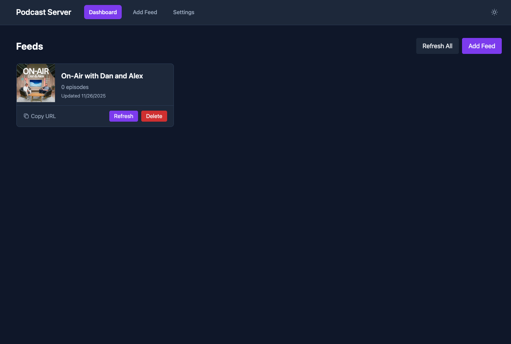
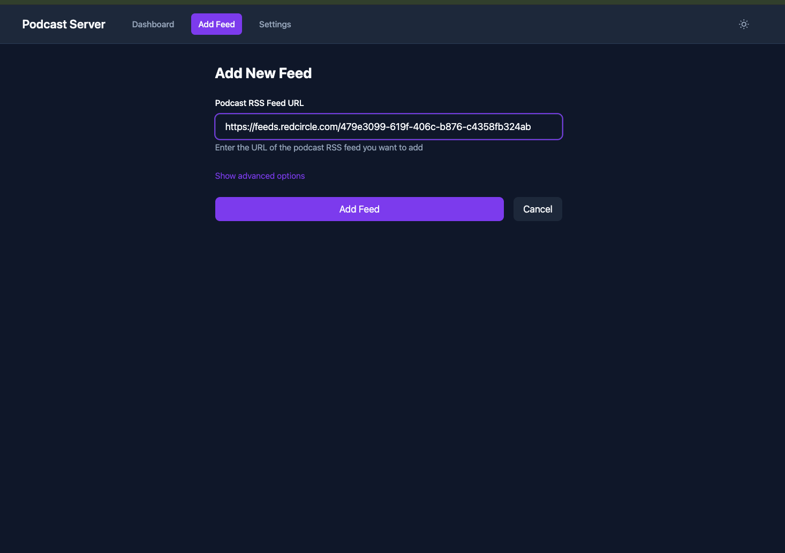
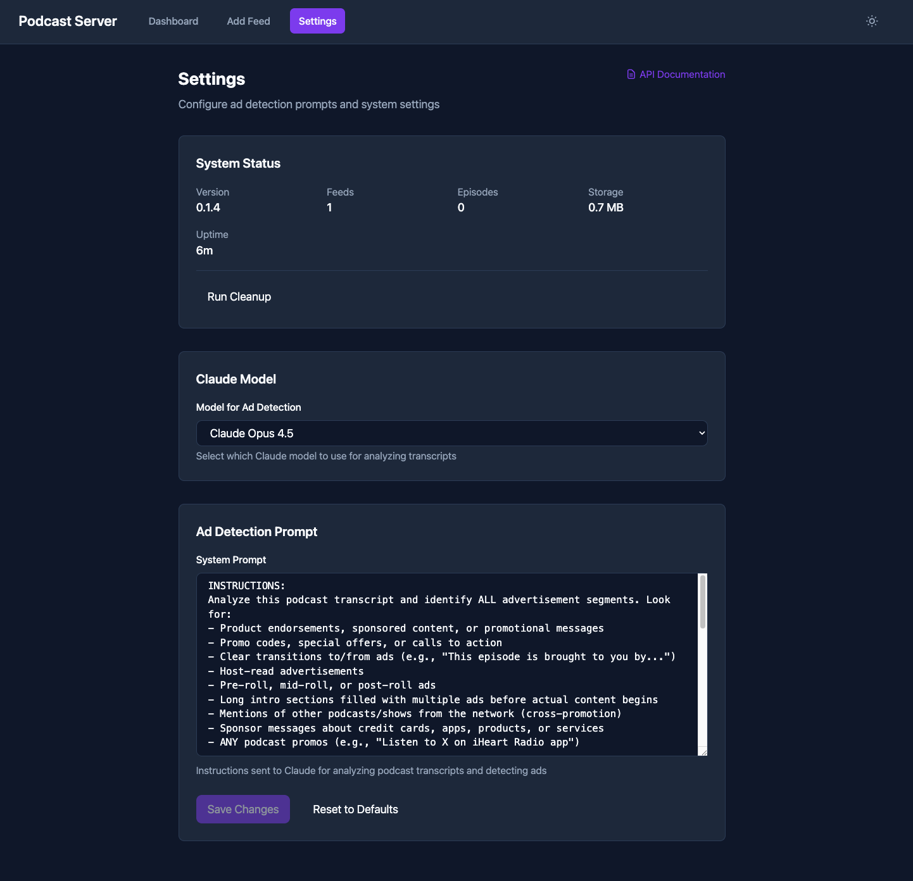
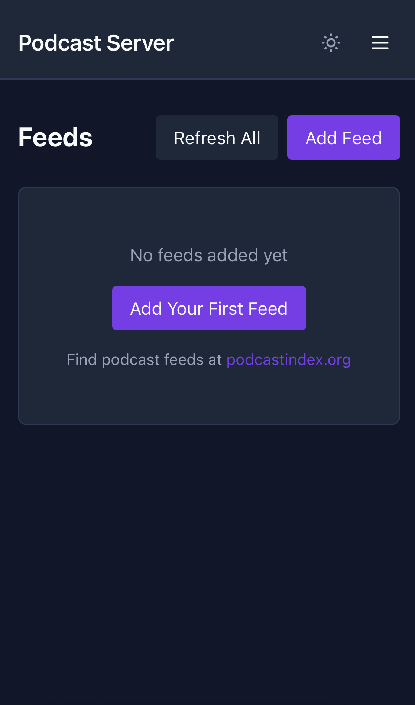
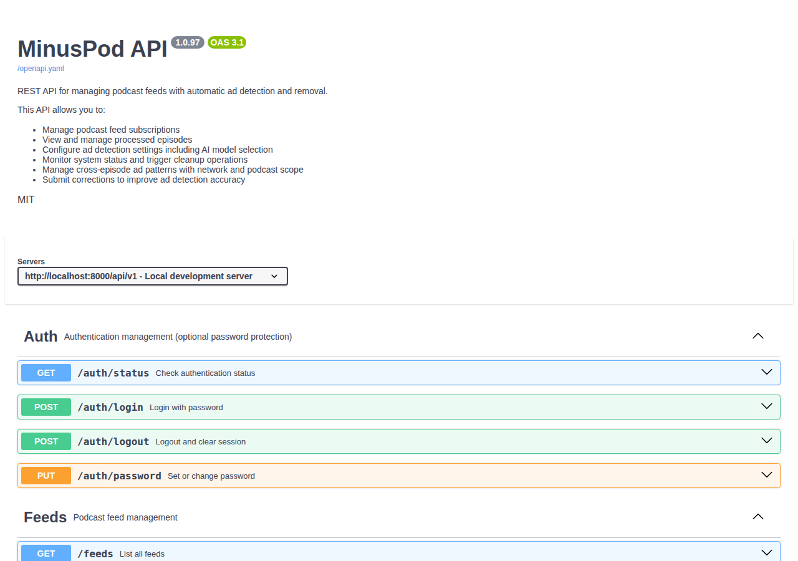

# Podcast Ad Removal Server

Removes ads from podcasts using Whisper transcription. Serves modified RSS feeds that work with any podcast app.

> **Disclaimer:** This tool is for personal use only. Only use it with podcasts you have permission to modify or where such modification is permitted under applicable laws. Respect content creators and their terms of service.

## How It Works

1. **Transcription** - Whisper converts audio to text with timestamps
2. **Ad Detection** - Claude API analyzes transcript to identify ad segments
3. **Audio Processing** - FFmpeg removes detected ads and inserts short audio markers
4. **Serving** - Flask serves modified RSS feeds and processed audio files

Processing happens on-demand when you play an episode. First play takes a few minutes, subsequent plays are instant (cached).

## Requirements

- Docker with NVIDIA GPU support (for Whisper)
- Anthropic API key

## Quick Start

```bash
# 1. Create environment file
cat > .env << EOF
ANTHROPIC_API_KEY=your-key-here
BASE_URL=http://localhost:8000
EOF

# 2. Create data directory
mkdir -p data

# 3. Run
docker-compose up -d
```

Access the web UI at `http://localhost:8000/ui/` to add and manage feeds.

## Web Interface

The server includes a web-based management UI at `/ui/`:

- **Dashboard** - View all feeds with artwork and episode counts
- **Add Feed** - Add new podcasts by RSS URL
- **Feed Management** - Refresh, delete, copy feed URLs
- **Settings** - Configure ad detection prompts and Claude model
- **System Status** - View statistics and run cleanup

### Screenshots

**Dashboard**



**Podcast View**


**Episode View**


**Add Feed**



**Settings**



**Mobile**



**API Documentation**



## Configuration

All configuration is managed through the web UI or REST API. No config files needed.

### Adding Feeds

1. Open `http://your-server:8000/ui/`
2. Click "Add Feed"
3. Enter the podcast RSS URL
4. Optionally set a custom slug (URL path)

### Ad Detection Settings

Customize ad detection prompts in Settings:
- **System Prompt** - Instructions for how Claude analyzes transcripts
- **User Prompt Template** - Template for analysis requests
- **Claude Model** - Select which model to use

## Finding Podcast RSS Feeds

Most podcasts publish RSS feeds. Common ways to find them:

1. **Podcast website** - Look for "RSS" link in footer or subscription options
2. **Apple Podcasts** - Search on [podcastindex.org](https://podcastindex.org) using the Apple Podcasts URL
3. **Spotify-exclusive** - Not available (Spotify doesn't expose RSS feeds)
4. **Hosting platforms** - Common patterns:
   - Libsyn: `https://showname.libsyn.com/rss`
   - Spreaker: `https://www.spreaker.com/show/{id}/episodes/feed`
   - Omny: Check page source for `omnycontent.com` URLs

## Usage

Add your modified feed URL to any podcast app:
```
http://your-server:8000/your-feed-slug
```

The feed URL is shown in the web UI and can be copied to clipboard.

## Environment Variables

| Variable | Default | Description |
|----------|---------|-------------|
| `ANTHROPIC_API_KEY` | required | Claude API key |
| `BASE_URL` | `http://localhost:8000` | Public URL for generated feed links |
| `WHISPER_MODEL` | `small` | Whisper model size (tiny/base/small/medium/large) |
| `WHISPER_DEVICE` | `cuda` | Device for Whisper (cuda/cpu) |
| `RETENTION_PERIOD` | `1440` | Minutes to keep processed episodes (1440 = 24 hours) |
| `TUNNEL_TOKEN` | optional | Cloudflare tunnel token for remote access |

## API

REST API available at `/api/v1/`. See `openapi.yaml` for full documentation.

Key endpoints:
- `GET /api/v1/feeds` - List all feeds
- `POST /api/v1/feeds` - Add a new feed
- `GET /api/v1/settings` - Get current settings
- `PUT /api/v1/settings/ad-detection` - Update ad detection config

## Remote Access

The docker-compose includes an optional Cloudflare tunnel service for secure remote access without port forwarding:

1. Create a tunnel at [Cloudflare Zero Trust](https://one.dash.cloudflare.com/)
2. Add `TUNNEL_TOKEN` to your `.env` file
3. Configure the tunnel to point to `http://podcast-server:8000`

### Security Recommendations

When exposing your feed to the internet (required for apps like Pocket Casts), consider adding WAF rules to:
- Only allow requests from known podcast app User-Agents
- Block access to admin endpoints (`/ui`, `/docs`, `/api`)

**Cloudflare WAF Example**

Create a custom rule to allow only Pocket Casts and block admin paths:

```
Rule name: feed_only_allow_pocketcasts

Expression:
(http.request.full_uri wildcard r"http*://feed.example.com/*" and not http.user_agent wildcard "*Pocket*Casts*") or (http.request.uri.path in {"/ui" "/docs"})

Action: Block
```

This blocks:
- Any request to your feed domain without "Pocket Casts" in the User-Agent
- All requests to `/ui` and `/docs` endpoints

Adjust the User-Agent pattern for your podcast app (e.g., `*Overcast*`, `*Castro*`, `*AntennaPod*`).

## Data Storage

All data is stored in the `./data` directory:
- `podcast.db` - SQLite database with feeds, episodes, and settings
- `{slug}/` - Per-feed directories with cached RSS and processed audio

## License

MIT
