# MinusPod

Removes ads from podcasts using Whisper transcription. Serves modified RSS feeds that work with any podcast app.

> **Disclaimer:** This tool is for personal use only. Only use it with podcasts you have permission to modify or where such modification is permitted under applicable laws. Respect content creators and their terms of service.

## How It Works

1. **Transcription** - Whisper converts audio to text with timestamps
2. **Ad Detection** - Claude API analyzes transcript to identify ad segments (with optional dual-pass detection)
3. **Audio Processing** - FFmpeg removes detected ads and inserts short audio markers
4. **Serving** - Flask serves modified RSS feeds and processed audio files

Processing happens on-demand when you play an episode. First play takes a few minutes, subsequent plays are instant (cached).

## Advanced Features (Quick Reference)

| Feature | Description | Enable In |
|---------|-------------|-----------|
| **Verification Pass** | Post-cut re-detection catches missed ads by re-transcribing processed audio | Automatic |
| **Audio Enforcement** | Volume and transition signals programmatically validate and extend ad detections | Automatic |
| **Pattern Learning** | System learns from corrections, patterns promote from podcast to network to global scope | Automatic |
| **Confidence Thresholds** | >=80% confidence: cut; 50-79%: kept for review; <50%: rejected | Automatic |

See detailed sections below for configuration and usage.

### Verification Pass

After the first pass detects and removes ads, a verification pipeline runs on the processed audio:

1. **Re-transcribe** - The processed audio is re-transcribed on CPU using Whisper
2. **Audio Analysis** - Volume analysis and transition detection run on the processed audio
3. **Claude Detection** - A "what doesn't belong" prompt detects any remaining ad content
4. **Audio Enforcement** - Programmatic signal matching validates and extends detections
5. **Re-cut** - If missed ads are found, the pass 1 output is re-cut directly

Each detected ad shows a badge indicating which stage found it:
- **First Pass** (blue) - Found by Claude's first pass
- **Audio Enforced** (orange) - Found by programmatic audio signal matching
- **Verification** (purple) - Found by the post-cut verification pass

The verification model can be configured separately from the first pass model in Settings.

### Sliding Window Processing

For long episodes, transcripts are processed in overlapping 10-minute windows:

- **Window Size** - 10 minutes of transcript per API call
- **Overlap** - 3 minutes between windows ensures ads at boundaries aren't missed
- **Deduplication** - Ads detected in multiple windows are automatically merged

This approach ensures consistent detection quality regardless of episode length. A 60-minute episode is processed as 9 overlapping windows, with any duplicate detections combined into a single ad marker.

### Processing Queue

To prevent memory issues from concurrent processing, episodes are processed one at a time:

- **Single Processing** - Only one episode processes at a time (Whisper + FFMPEG are memory-intensive)
- **Background Processing** - Processing runs in a background thread, keeping UI responsive
- **Automatic Recovery** - Episodes stuck in "processing" status are automatically reset on server restart
- **Queue Management** - View and cancel processing episodes in Settings

When you request an episode that needs processing:
1. If nothing is processing, it starts in the background and returns HTTP 503 with `Retry-After: 30`
2. If another episode is processing, it returns HTTP 503 (your podcast app will retry)
3. Once processed, subsequent requests serve the cached file instantly

### Post-Detection Validation

After ad detection, a validation layer reviews each detection before audio processing:

- **Duration checks** - Rejects ads shorter than 7s or longer than 5 minutes
- **Confidence thresholds** - Rejects very low confidence detections (<0.3); only cuts ads with >=80% adjusted confidence
- **Position heuristics** - Boosts confidence for typical ad positions (pre-roll, mid-roll, post-roll)
- **Transcript verification** - Checks for sponsor names and ad signals in the transcript
- **Auto-correction** - Merges ads with tiny gaps, clamps boundaries to valid range

Ads are classified as:
- **ACCEPT** - High confidence, removed from audio
- **REVIEW** - Medium confidence, removed but flagged for review
- **REJECT** - Too short/long, low confidence, or missing ad signals - kept in audio

Rejected ads appear in a separate "Rejected Detections" section in the UI, allowing you to verify the validator's decisions.

### Cross-Episode Ad Pattern Learning

The system learns from ad detections across all episodes to improve accuracy over time. When an ad is detected and validated, text patterns are extracted and stored for future matching.

**Pattern Hierarchy:**
- **Global Patterns** - Match across all podcasts (e.g., common sponsors like Squarespace, BetterHelp)
- **Network Patterns** - Match within a podcast network (TWiT, Relay FM, Gimlet, etc.)
- **Podcast Patterns** - Match only for a specific podcast

When processing new episodes, the system first checks for known patterns before sending to Claude. Patterns with high confirmation counts and low false positive rates are matched with high confidence.

**Pattern Sources:**
- **Audio Fingerprinting** - Identifies DAI-inserted ads using Chromaprint acoustic fingerprints
- **Text Pattern Matching** - TF-IDF similarity and fuzzy matching against learned patterns
- **Claude Analysis** - Falls back to AI analysis for uncovered segments

**User Corrections:**
In the transcript editor, you can confirm, reject, or adjust detected ads:
- **Confirm** - Creates/updates patterns in the database, incrementing confirmation count
- **Adjust Boundaries** - Corrects start/end times for an ad; also creates patterns from adjusted boundaries (like confirm), ensuring accurate pattern text is learned
- **Mark as Not Ad** - Flags as false positive and stores the transcript text. Similar text is automatically excluded in future episodes of the same podcast using TF-IDF similarity matching (cross-episode false positive learning)

**Pattern Management:**
Access the Patterns page from the navigation bar to:
- View all patterns with their scope, sponsor, and statistics
- Filter by scope (Global, Network, Podcast) or search by sponsor name
- Toggle patterns active/inactive
- View confirmation and false positive counts

### Real-Time Processing Status

A global status bar shows real-time processing progress via Server-Sent Events:

- **Processing Indicator** - Shows currently processing episode title
- **Stage Display** - Current stage (Transcribing, Detecting Ads, Processing Audio)
- **Progress Bar** - Visual progress indicator
- **Queue Depth** - Number of episodes waiting to be processed
- **Quick Navigation** - Click to view the processing episode

### Reprocessing Modes

When reprocessing an episode from the UI, two modes are available:

- **Reprocess** (default) - Uses learned patterns from the pattern database plus Claude analysis
- **Full Analysis** - Skips the pattern database entirely for a fresh Claude-only analysis

Full Analysis is useful when you want to re-evaluate an episode without the influence of learned patterns (e.g., after disabling patterns that caused false positives).

### Audio Analysis

Audio analysis runs automatically on every episode (lightweight, uses only ffmpeg):

- **Volume Analysis** - Detects loudness anomalies using EBU R128 measurement. Identifies sections mastered at different levels than the content baseline.
- **Transition Detection** - Finds abrupt frame-to-frame loudness jumps that indicate dynamically inserted ad (DAI) boundaries. Pairs up/down transitions into candidate ad regions.
- **Audio Enforcement** - After Claude detection, uncovered audio signals with ad language in the transcript are promoted to ads. DAI transitions with high confidence (>=0.8) or sponsor matches are also promoted. Existing ad boundaries are extended when signals partially overlap.

## Requirements

- Docker with NVIDIA GPU support (for Whisper)
- Anthropic API key

### Memory Requirements

**GPU VRAM:**

| Whisper Model | VRAM Required |
|---------------|---------------|
| tiny | ~1 GB |
| base | ~1 GB |
| small | ~2 GB |
| medium | ~4 GB |
| large-v3 | ~5-6 GB |

**System RAM:**

| Episode Length | RAM Required |
|----------------|-------------|
| < 1 hour | 8 GB |
| 1-2 hours | 8 GB |
| 2-4 hours | 12 GB |
| > 4 hours | 16 GB |

## Quick Start

```bash
# 1. Create environment file
cat > .env << EOF
ANTHROPIC_API_KEY=your-key-here
BASE_URL=http://localhost:8000
EOF

# 2. Create data directory
mkdir -p data

# 3. Run
docker-compose up -d
```

Access the web UI at `http://localhost:8000/ui/` to add and manage feeds.

## Web Interface

The server includes a web-based management UI at `/ui/`:

- **Dashboard** - View all feeds with artwork and episode counts
- **Add Feed** - Add new podcasts by RSS URL
- **Feed Management** - Refresh, delete, copy feed URLs, set network override
- **Patterns** - View and manage cross-episode ad patterns with sponsor names
- **History** - View processing history with stats, filtering, and export
- **Settings** - Configure ad detection prompts and Claude model
- **System Status** - View statistics, LLM token usage and cost, and run cleanup
- **Real-Time Status Bar** - Shows current processing progress across all pages

### Transcript Editor (Mobile-First)

The transcript editor allows you to review and adjust ad detections directly in the browser. It's optimized for mobile as the primary interface:

**Mobile Features:**
- **Touch-Optimized** - All buttons meet 44-48px accessibility standards for easy tapping
- **Swipe Navigation** - Swipe left/right on transcript to navigate between ads
- **Haptic Feedback** - Vibration feedback on boundary adjustments and actions
- **Bottom Sheet Player** - Apple Podcasts-style collapsible audio controls
- **Draggable Progress** - Touch-drag seeking with visual thumb indicator
- **Icon Buttons** - Compact action buttons (X, reset, check, save) with full labels in expanded mode
- **Landscape Mode** - Optimized layout for horizontal orientation

**Touch Gestures:**
- Single tap: Seek to segment (or set boundary in Set Start/End mode)
- Double tap: Set start boundary
- Long press: Set end boundary
- Horizontal swipe: Navigate to previous/next ad

**Desktop Features:**
- Keyboard shortcuts for quick editing (Space, J/K, Shift+J/K, C, X, Esc)
- Click to seek, Shift+Click to set end, Alt+Click to set start
- Inline audio player with hover-expandable progress bar

### Screenshots

#### Dashboard
| Desktop | Mobile |
|---------|--------|
| 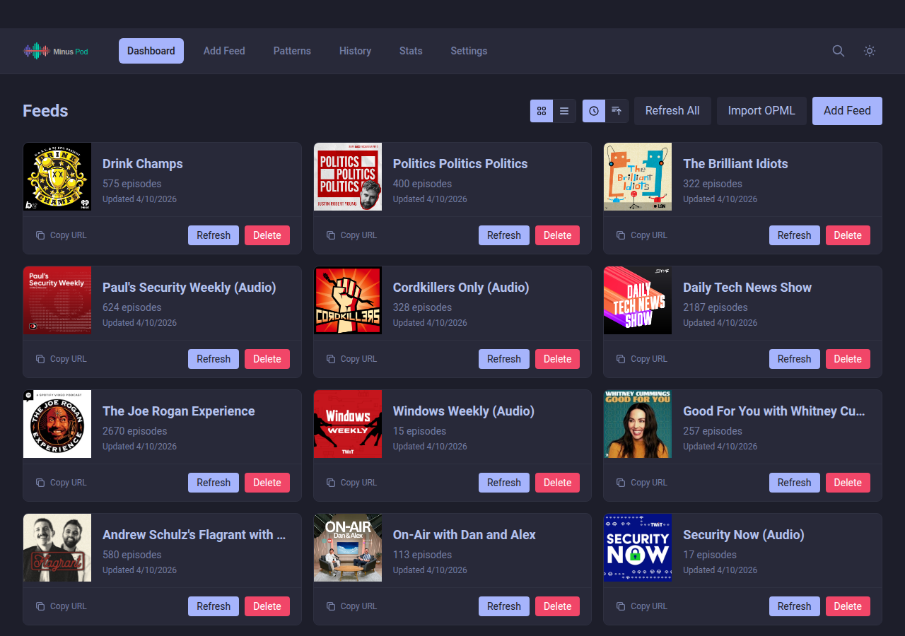 |  |

#### Feed Detail
| Desktop | Mobile |
|---------|--------|
| 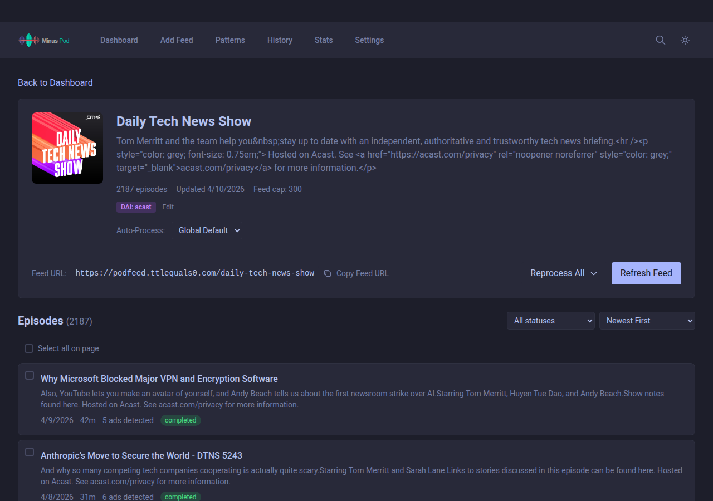 | 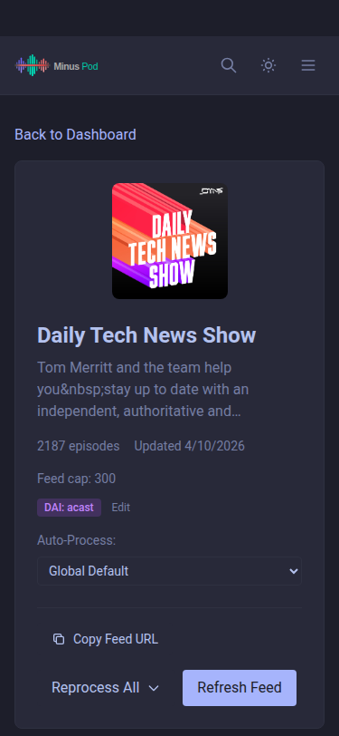 |

#### Episode Detail
| Desktop | Mobile |
|---------|--------|
| 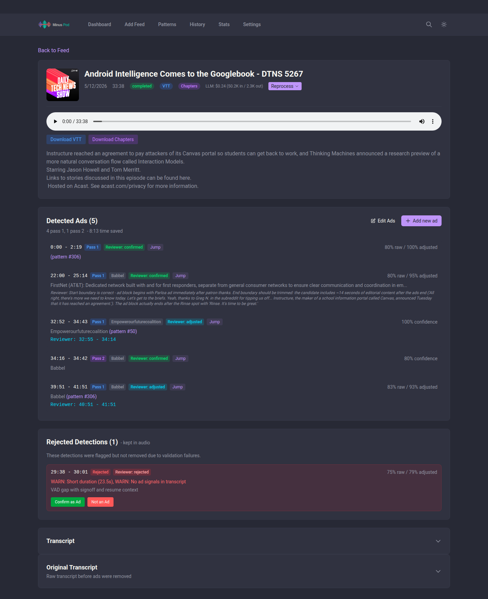 | 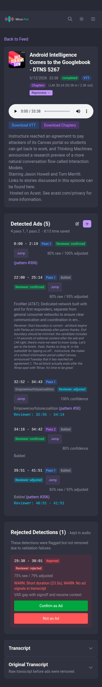 |

#### Detected Ads
| Desktop | Mobile |
|---------|--------|
| 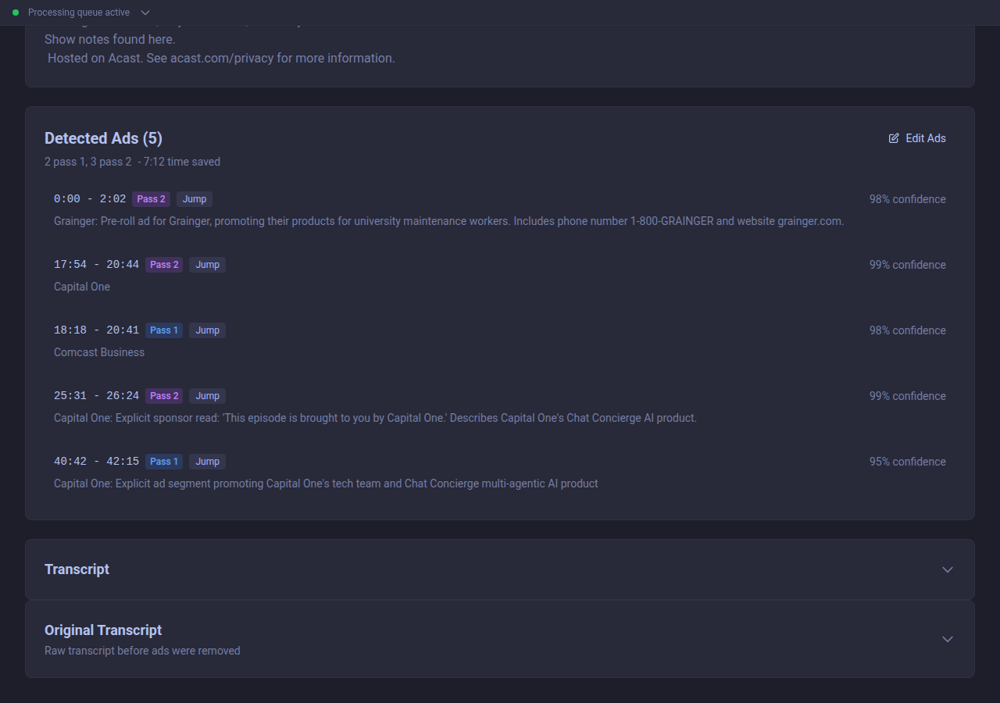 | 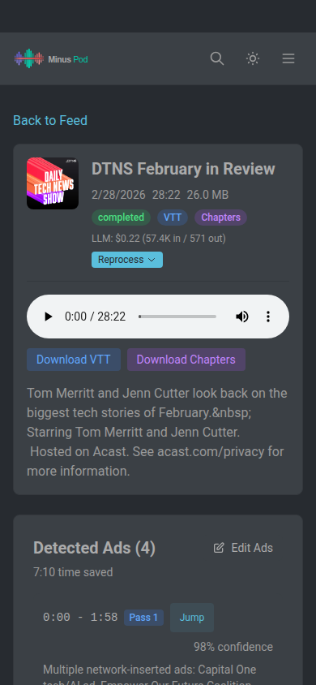 |

#### Ad Editor
| Desktop | Mobile |
|---------|--------|
| 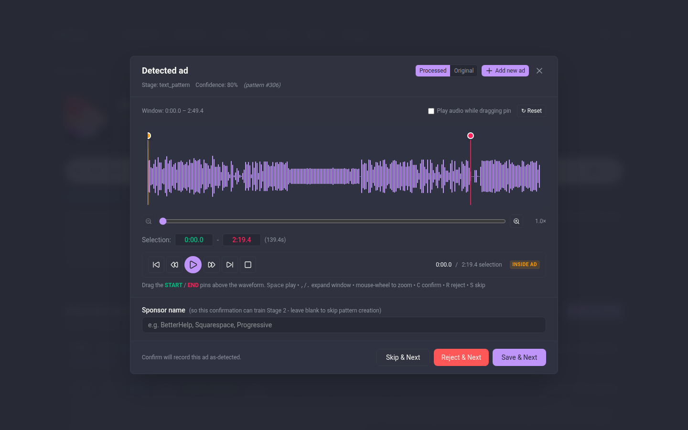 | 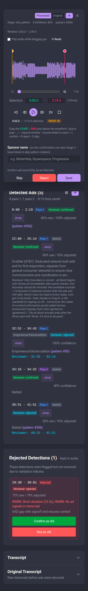 |

#### Ad Patterns
| Desktop | Mobile |
|---------|--------|
| 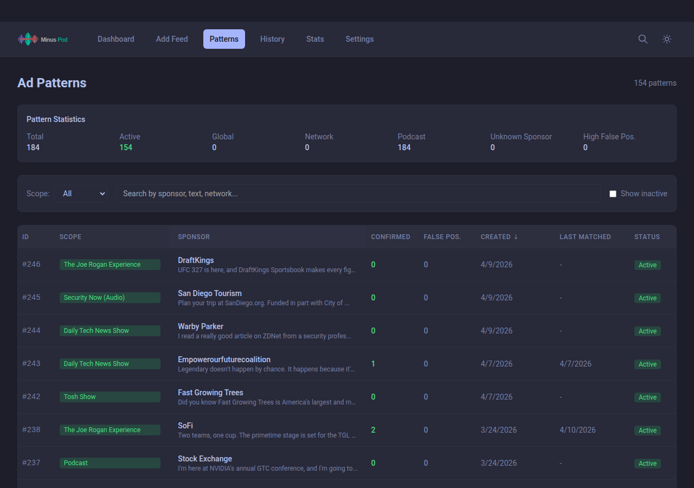 | 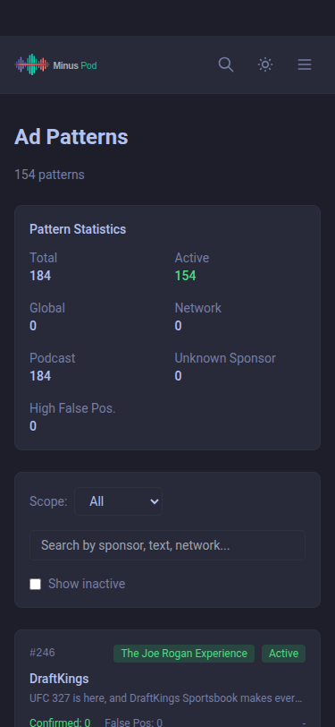 |

#### Settings
| Desktop | Mobile |
|---------|--------|
| 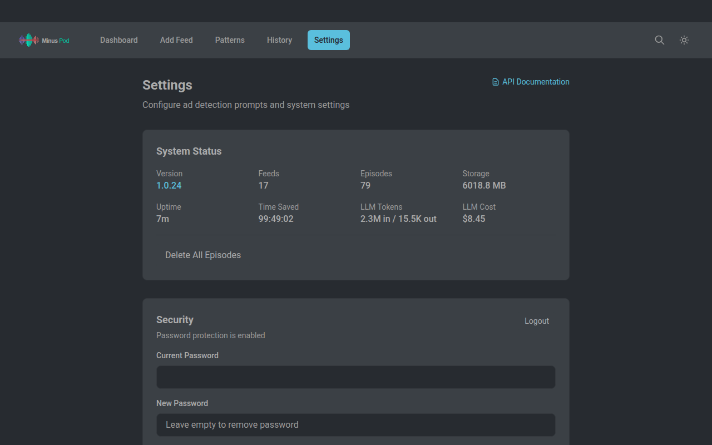 | 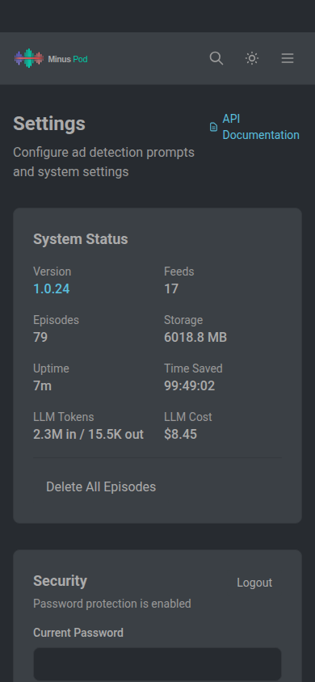 |

#### API Documentation


## Configuration

All configuration is managed through the web UI or REST API. No config files needed.

### Adding Feeds

1. Open `http://your-server:8000/ui/`
2. Click "Add Feed"
3. Enter the podcast RSS URL
4. Optionally set a custom slug (URL path)

### Ad Detection Settings

Customize ad detection in Settings:
- **Claude Model** - Model for first pass ad detection
- **Verification Model** - Separate model for the post-cut verification pass
- **System Prompts** - Customizable prompts for first pass and verification detection

## Finding Podcast RSS Feeds

Most podcasts publish RSS feeds. Common ways to find them:

1. **Podcast website** - Look for "RSS" link in footer or subscription options
2. **Apple Podcasts** - Search on [podcastindex.org](https://podcastindex.org) using the Apple Podcasts URL
3. **Spotify-exclusive** - Not available (Spotify doesn't expose RSS feeds)
4. **Hosting platforms** - Common patterns:
   - Libsyn: `https://showname.libsyn.com/rss`
   - Spreaker: `https://www.spreaker.com/show/{id}/episodes/feed`
   - Omny: Check page source for `omnycontent.com` URLs

## Usage

Add your modified feed URL to any podcast app:
```
http://your-server:8000/your-feed-slug
```

The feed URL is shown in the web UI and can be copied to clipboard.

## Environment Variables

| Variable | Default | Description |
|----------|---------|-------------|
| `ANTHROPIC_API_KEY` | required | Claude API key (required for default Anthropic provider) |
| `LLM_PROVIDER` | `anthropic` | LLM backend: `anthropic` (direct API) or `openai-compatible` (wrapper/Ollama) |
| `OPENAI_BASE_URL` | `http://localhost:8000/v1` | Base URL for OpenAI-compatible API (only used if `LLM_PROVIDER=openai-compatible`) |
| `OPENAI_API_KEY` | `not-needed` | API key for OpenAI-compatible endpoint (often not required for local wrappers) |
| `BASE_URL` | `http://localhost:8000` | Public URL for generated feed links |
| `WHISPER_MODEL` | `small` | Whisper model size (tiny/base/small/medium/large) |
| `WHISPER_DEVICE` | `cuda` | Device for Whisper (cuda/cpu) |
| `RETENTION_PERIOD` | `1440` | Minutes to keep processed episodes (1440 = 24 hours) |
| `TUNNEL_TOKEN` | optional | Cloudflare tunnel token for remote access |

### Using Claude Code Wrapper (Max Subscription)

Instead of using API credits, you can use the [Claude Code OpenAI Wrapper](https://github.com/ttlequals0/claude-code-openai-wrapper) to leverage your Claude Max subscription.

**Quick Start:**

1. Start the wrapper service:
   ```bash
   docker compose --profile wrapper up -d
   ```

2. Authenticate with Claude (first time only):
   ```bash
   docker compose --profile wrapper run --rm claude-wrapper claude auth login
   ```

3. Configure minuspod to use the wrapper by updating your `.env`:
   ```bash
   LLM_PROVIDER=openai-compatible
   OPENAI_BASE_URL=http://claude-wrapper:8000/v1
   OPENAI_API_KEY=not-needed
   ```

4. Restart minuspod:
   ```bash
   docker compose up -d minuspod
   ```

The wrapper exposes an OpenAI-compatible API that routes requests through your Claude Max subscription instead of consuming API credits.

**Other OpenAI-Compatible Endpoints:**

The `openai-compatible` provider can work with other endpoints by configuring `OPENAI_BASE_URL` and `OPENAI_API_KEY` accordingly. The model is selected via the Settings UI.

**Example `.env` for OpenAI-compatible mode:**

```bash
# LLM Configuration (OpenAI-compatible)
LLM_PROVIDER=openai-compatible
OPENAI_BASE_URL=http://claude-wrapper:8000/v1
OPENAI_API_KEY=not-needed

# Server Configuration
BASE_URL=http://localhost:8000
```

Note: The Claude model is configured via the Settings UI, not environment variables.

## API

REST API available at `/api/v1/`. Interactive docs at `/docs`. See `openapi.yaml` for full specification.

Key endpoints:
- `GET /api/v1/feeds` - List all feeds
- `POST /api/v1/feeds` - Add a new feed
- `POST /api/v1/feeds/import-opml` - Import feeds from OPML file
- `POST /api/v1/feeds/{slug}/episodes/{id}/reprocess` - Force reprocess (supports `mode`: reprocess/full)
- `POST /api/v1/feeds/{slug}/reprocess-all` - Batch reprocess all episodes
- `POST /api/v1/feeds/{slug}/episodes/{id}/retry-ad-detection` - Retry ad detection only
- `POST /api/v1/feeds/{slug}/episodes/{id}/corrections` - Submit ad corrections
- `GET /api/v1/patterns` - List ad patterns (filter by scope)
- `GET /api/v1/patterns/stats` - Pattern database statistics
- `GET /api/v1/sponsors` - List/create/update/delete sponsors (full CRUD)
- `GET /api/v1/search?q=query` - Full-text search across all content
- `GET /api/v1/history` - Processing history with pagination and export
- `GET /api/v1/status` - Current processing status
- `GET /api/v1/status/stream` - SSE endpoint for real-time status updates
- `GET /api/v1/system/token-usage` - LLM token usage and cost breakdown by model
- `GET /api/v1/system/model-pricing` - All known LLM model pricing rates
- `GET /api/v1/settings` - Get current settings
- `PUT /api/v1/settings/ad-detection` - Update ad detection config

## Remote Access

The docker-compose includes an optional Cloudflare tunnel service for secure remote access without port forwarding:

1. Create a tunnel at [Cloudflare Zero Trust](https://one.dash.cloudflare.com/)
2. Add `TUNNEL_TOKEN` to your `.env` file
3. Configure the tunnel to point to `http://minuspod:8000`

### Security Recommendations

When exposing your feed to the internet (required for apps like Pocket Casts), consider adding WAF rules to:
- Only allow requests from known podcast app User-Agents
- Block access to admin endpoints (`/ui`, `/docs`, `/api`)

**Cloudflare WAF Example**

Create a custom rule to allow only Pocket Casts and block admin paths:

```
Rule name: feed_only_allow_pocketcasts

Expression:
(http.request.full_uri wildcard r"http*://feed.example.com/*" and not http.user_agent wildcard "*Pocket*Casts*") or (http.request.uri.path in {"/ui" "/docs"})

Action: Block
```

This blocks:
- Any request to your feed domain without "Pocket Casts" in the User-Agent
- All requests to `/ui` and `/docs` endpoints

Adjust the User-Agent pattern for your podcast app (e.g., `*Overcast*`, `*Castro*`, `*AntennaPod*`).

## Data Storage

All data is stored in the `./data` directory:
- `podcast.db` - SQLite database with feeds, episodes, and settings
- `{slug}/` - Per-feed directories with cached RSS and processed audio

## Custom Assets (Optional)

By default, a short audio marker is played where ads were removed. You can customize this by providing your own replacement audio:

1. Create an `assets` directory next to your docker-compose.yml
2. Place your custom `replace.mp3` file in the assets directory
3. Uncomment the assets volume mount in docker-compose.yml:
   ```yaml
   volumes:
     - ./data:/app/data
     - ./assets:/app/assets:ro  # Uncomment this line
   ```
4. Restart the container

The `replace.mp3` file will be inserted at each ad break. Keep it short (1-3 seconds) to avoid disrupting the listening experience. If no custom asset is provided, the built-in default marker is used.

## License

MIT
