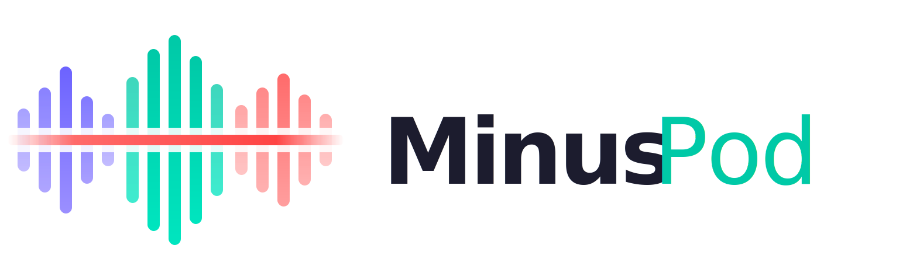

<p align="center">
  
</p>

MinusPod is a self-hosted server that removes ads before you ever hit play. It transcribes episodes with Whisper, uses an LLM to detect and cut ad segments, and builds cross-episode ad patterns from your corrections so repeat sponsors get caught without re-asking the LLM. Bring your own LLM: Claude, Ollama, OpenRouter, or any OpenAI-compatible provider.

## Features

**Ad detection**
- First-pass LLM detection over sliding windows, plus an automatic verification pass on the re-cut audio
- Optional ad-reviewer stage that confirms, adjusts, or rejects each cut and can resurrect borderline detections
- Audio-side signals: loudness analysis, DAI transition detection, pre/post-roll, and a VAD-gap detector for spans Whisper drops
- Per-feed audio cue detection that snaps cuts to a show's jingle or stinger
- Confidence scoring with a review queue; rejected detections stay visible for auditing

**Transcription**
- Local Whisper on GPU or CPU via faster-whisper, or a remote OpenAI-compatible API
- Works with whisper.cpp, Groq, OpenAI Whisper, and OpenVINO (Intel GPU)

**LLM providers**
- Bring your own: Anthropic, OpenRouter, Ollama, or any OpenAI-compatible endpoint, switchable at runtime
- Per-stage tuning (model, temperature, tokens, reasoning) and editable prompts with per-pass overrides
- Provider keys encrypted with AES-256-GCM behind a master passphrase

**Patterns and sponsors**
- Cross-episode pattern learning from your corrections, scoped podcast to network to global
- Sponsor list with aliases and normalizations
- Opt-in community pattern sync, with one-PR submission back

**Publishing**
- Re-cut RSS feeds served per podcast, with versioned audio files
- Podcasting 2.0: regenerated transcripts and chapters, AI-content disclosure, value-for-value tags passed through
- OPML import/export, and an optional cover-art badge that marks the re-feed

**Interface and ops**
- Web UI with a waveform ad editor, plus feed, episode, pattern, sponsor, history, and stats views
- Stats and cost analytics: ads cut, time saved, token usage and spend
- Retention controls, encrypted backups, webhooks, and a full REST API with OpenAPI
- Single shared-password auth; runs behind a reverse proxy or Cloudflare tunnel

## How it works

1. **Transcription** - Whisper converts audio to text with timestamps (local GPU via faster-whisper, or remote API via OpenAI-compatible endpoint)
2. **Ad Detection** - An LLM analyzes the transcript to identify ad segments, with an automatic verification pass
3. **Audio Processing** - FFmpeg removes detected ads and inserts short audio markers
4. **Serving** - Flask serves modified RSS feeds and processed audio files

Processing happens on-demand when you play an episode, or automatically when new episodes appear. An episode is processed once; processing time depends on episode length, hardware, and chosen models. After processing, the output is stored on disk and served directly on subsequent plays.

Full pipeline detail (verification pass, sliding windows, pattern learning, audio analysis) is in [docs/how-it-works.md](docs/how-it-works.md).

## Requirements

- Docker with NVIDIA GPU support (for local Whisper), **or** a [remote Whisper backend](docs/transcription.md) (no GPU needed)
- Anthropic API key, [OpenRouter](https://openrouter.ai) API key, [Ollama](https://ollama.com) for local inference, **or** any OpenAI-compatible endpoint

Memory and VRAM tables are in [docs/installation.md](docs/installation.md).

## Quick start

```bash
# 1. Create environment file
cat > .env << EOF
ANTHROPIC_API_KEY=your-key-here
BASE_URL=http://localhost:8000
MINUSPOD_MASTER_PASSPHRASE=long-random-string-you-will-not-lose
EOF

# 2. Create data directory
mkdir -p data

# 3. Run
docker-compose up -d
```

Access the web UI at `http://localhost:8000/ui/` to add and manage feeds.

`MINUSPOD_MASTER_PASSPHRASE` is strongly recommended for production. Without it, provider API keys go into the database as plaintext. Setting it later migrates existing plaintext rows to `enc:v1:` encrypted storage on the next boot, with a mandatory pre-migration SQLite snapshot in `data/backups/`. Restoring a backup requires the same passphrase that created it, so pick a long random value and keep it somewhere separate from the database.

**No NVIDIA GPU?** Pull the CPU variant (`docker compose -f docker-compose.cpu.yml up -d`; multi-arch, runs natively on amd64 and arm64) and offload Whisper to a remote API. Full CPU setup and the 2.0.0+ upgrade notes are in [docs/installation.md](docs/installation.md).

## Documentation

| Topic | |
|---|---|
| [How It Works & Detection Pipeline](docs/how-it-works.md) | Verification pass, sliding windows, queue, validation, pattern learning, audio analysis |
| [Installation & Upgrading](docs/installation.md) | Requirements, quick start, CPU image, upgrading to 2.0.0+ |
| [Web Interface](docs/web-interface.md) | Management UI, ad editor workflow, screenshots |
| [Configuration & Experiments](docs/configuration.md) | Settings, per-stage LLM tuning, VAD gap detector, ad reviewer, reprocessing, community patterns, scheduled backups |
| [Audio Cue Detection](docs/audio-cues.md) | Per-feed cue templates, the find-audio-cues suggestion scan, settings, and tuning |
| [Community Patterns](patterns/README.md) | Crowdsourced ad pattern set: opt-in manifest sync, file format, and how to contribute |
| [Environment Variables](docs/environment-variables.md) | Every env var, grouped by how often you touch it |
| [LLM Providers](docs/llm-providers.md) | Claude Code wrapper, Ollama, OpenRouter, recommended models, pricing |
| [Whisper / Transcription](docs/transcription.md) | GPU compute types, whisper.cpp, Groq, OpenAI Whisper, timeouts |
| [Intel GPU Transcription (OpenVINO)](docs/transcription-openvino.md) | Offload Whisper to an Intel GPU via the OpenVINO Model Server |
| [Finding Feeds & Usage](docs/feeds-and-usage.md) | Podcast search, finding RSS feeds, Audiobookshelf |
| [API & Webhooks](docs/api-and-webhooks.md) | REST endpoints, webhook events, payload templates |
| [Security, Storage & Custom Assets](docs/security-and-storage.md) | Remote access, login lockout, backups, custom markers |
| [Podcasting 2.0](docs/podcasting-2.0.md) | What MinusPod emits, regenerates, and deliberately strips from the Podcast Namespace, and why |
| [Deployment Runbook](docs/DEPLOYMENT.md) | Operational runbook |
| [LLM Benchmark Report](benchmarks/llm/results/report.md) | Per-model F1, JSON compliance, latency, and cost across the benchmarked models |

Or browse the [full docs index](docs/README.md).

## Disclaimer

This tool is for personal use only. Only use it with podcasts you have permission to modify or where such modification is permitted under applicable laws. Respect content creators and their terms of service.

## License

MIT

## LLM disclosure

This project was developed using AI agents as a pair programmer. It was NOT vibe coded. For context, I'm a systems engineer who also writes code professionally with 15+ years of experience. The codebase follows engineering best practices, and all architecture and design decisions were made by me, not by AI. All code generated by LLMs was reviewed and tested by me, a human.
