# Web Interface

[< Docs index](README.md) | [Project README](../README.md)

---

## Web Interface

The server includes a web-based management UI at `/ui/`:

- Dashboard with feed artwork and episode counts
- Add feeds by RSS URL with optional episode cap
- Feed management: refresh, delete, copy URLs, set network override, per-feed episode cap
- Episode discovery: all episodes surface on refresh, process any episode from the feed detail page
- Bulk actions: select multiple episodes to process, reprocess, reprocess (full), or delete
- Sort by publish date, episode number, or creation date; paginated (25/50/100/500 per page)
- Pattern management: view and manage cross-episode ad patterns with sponsor names
- Processing history with stats, filtering by podcast, and CSV/JSON export
- Stats dashboard with charts: avg/min/max metrics, top podcasts by ads, episodes by day, token usage, sortable podcast table
- Settings for LLM provider, AI models, ad detection prompts, retention, system stats, token usage and cost
- Real-time status bar showing processing progress across all pages
- OPML export with original or ad-free (modified) feed URLs
- Global Defaults group in settings (Auto-Process, Max Feed Episodes, Only Expose Processed) that every feed inherits, with per-feed overrides on each feed's settings page
- Webhook notifications for processed episodes and auth failures
- Podcast search via PodcastIndex.org
- Multiple dark themes (Tokyo Night, Dracula, Catppuccin, Nord, Gruvbox, Solarized, and more) with light/dark toggle
- Installable as Progressive Web App (PWA)

### Ad Editor Workflow

The ad editor supports two review modes, selected by a toggle above the ads list:

- **Processed** (default): plays the post-cut output so you can verify what the final listener will hear. Ad timestamps map onto the new timeline.
- **Original**: plays the pre-cut download at the ad's original timestamps, so you can hear exactly what was removed.

Original mode requires the pre-cut audio to have been retained. That's controlled by the "Keep original audio for ad boundary review" toggle under Settings > Storage & Retention (default on). Keeping originals roughly doubles per-episode storage; disable it if disk is tight. Episodes processed before v1.6.0 have no retained original. The toggle is disabled (with a tooltip) until you reprocess.

The **Original Transcript** panel on the Episode Detail page shows the full pre-cut transcript so you can see exactly what text was identified and removed.

### Ad Editor

Review and adjust ad detections in the browser. 2.2.0 switches the editor to a wavesurfer.js waveform: drag the green start and red end pins to set boundaries, with an orange playhead, 1x to 20x zoom (slider or mouse wheel), and a transport bar (skip back, rewind 10s, play, forward 10s, skip forward, stop). 2.3.1-2.3.4 added a playback speed dropdown (0.5x to 2x) next to the play button and a full-episode scrubber under the zoom slider so you can jump anywhere in the audio regardless of how the waveform is zoomed. The scrubber shows a muted gray band for the slice currently visible in the waveform, a primary-color fill tracking playback, and a thumb at the current position. Click or drag to seek; Arrow keys nudge by 5s (Shift = 10s), Home/End jump to ends. Edit Ads opens centered on the detected ad with ~30s of context; Add new ad opens with the entire episode visible. Typing a time outside the current waveform window auto-expands the window to include the pin. The Selection text inputs clamp only to episode bounds; cross-field validation (Start before End, at least 1s) happens on Save with a red border and an inline error if invalid.

Each ad shows why it was flagged, the confidence percentage, and the detection stage. The selection readout shows the current bounds plus the originals if you've moved a pin. An INSIDE AD badge lights up when the playhead sits between the pins. Playback auto-seeks to ~2 seconds before the ad start when you open or switch ads, so you land in context instead of at the beginning of the episode.

A header row above the waveform lets you toggle Processed / Original (separate from the page-level toggle - this one applies to what plays in the editor) and jump straight into create mode with `+ Add new ad`. Waveform colors follow the active theme; the dark theme uses the same muted/primary palette as the rest of the UI so the pins and playhead stay readable on both backgrounds.

Sponsor is a real autocomplete combobox seeded from the known-sponsor catalog plus any sponsors you've used recently on this podcast. Typing filters the list; clicking a row fills the field. You can also just type a new name and submit.

On mobile the layout stacks vertically and the keyboard hint footer goes away; everything is touch-driven from there.

On desktop you get `Space` for play/pause, arrow keys to nudge the focused pin, mouse wheel to zoom in or out anchored on the cursor, and `C` / `R` / `S` to confirm / reject / skip. Clicking the dimmed backdrop closes the editor in review mode; backdrop-close is disabled in create mode so you don't lose an in-progress entry by clicking outside.

### Adding a New Ad

If the detector missed one, click `+ Add new ad` from the episode page header or from the same button inside the editor modal. The editor opens in create mode against the original (pre-cut) audio so you hear exactly what the listener would have heard: enter start and end timestamps or drag the pins on the waveform, pick a sponsor from the autocomplete or type a new one, and the text template auto-populates from the transcript span between your bounds. Submitting creates a new pattern with `created_by='user'` and writes a `'create'` correction so the pattern matcher picks it up on future episodes. The Patterns page tags manually created patterns with a `Manual` badge and adds an Origin filter (All / Auto / Manual).

### Screenshots

#### Dashboard
| Desktop | Mobile |
|---------|--------|
| 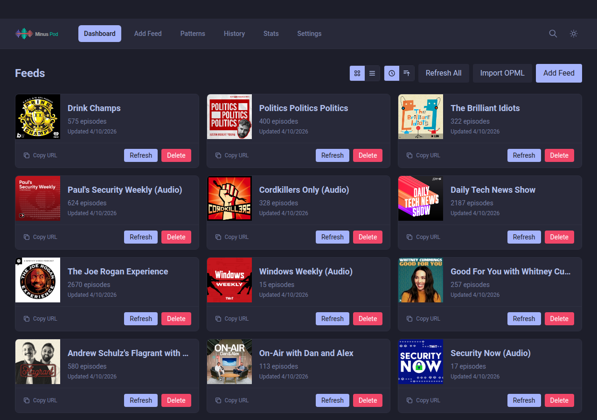 | 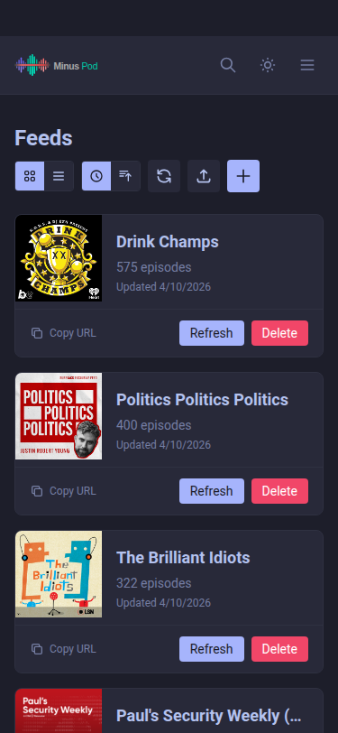 |

#### Feed Detail
| Desktop | Mobile |
|---------|--------|
| 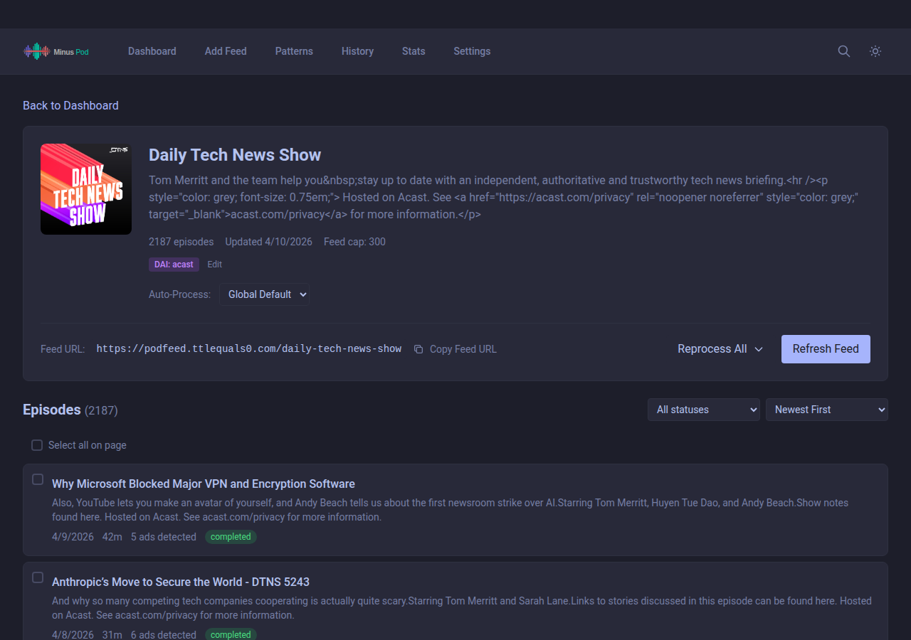 | 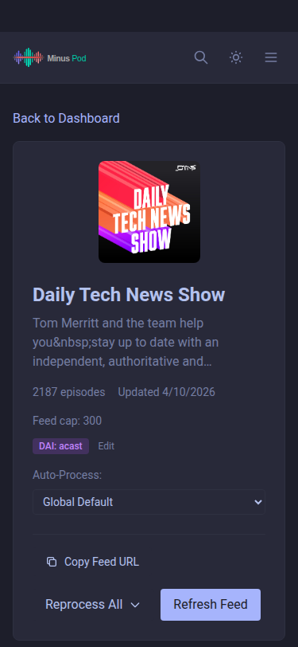 |

#### Episode Detail
| Desktop | Mobile |
|---------|--------|
| 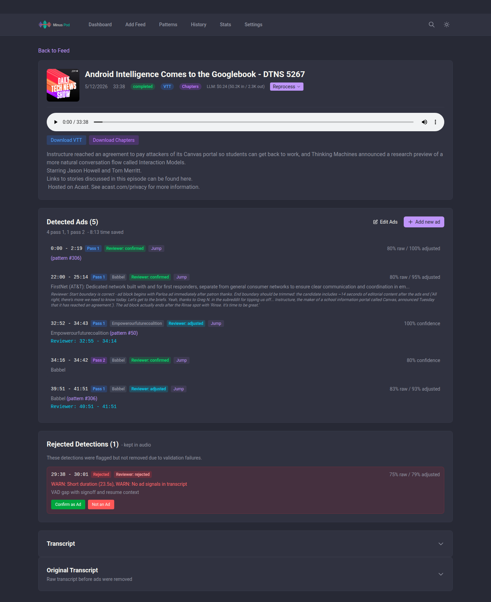 |  |

#### Detected Ads
| Desktop | Mobile |
|---------|--------|
| 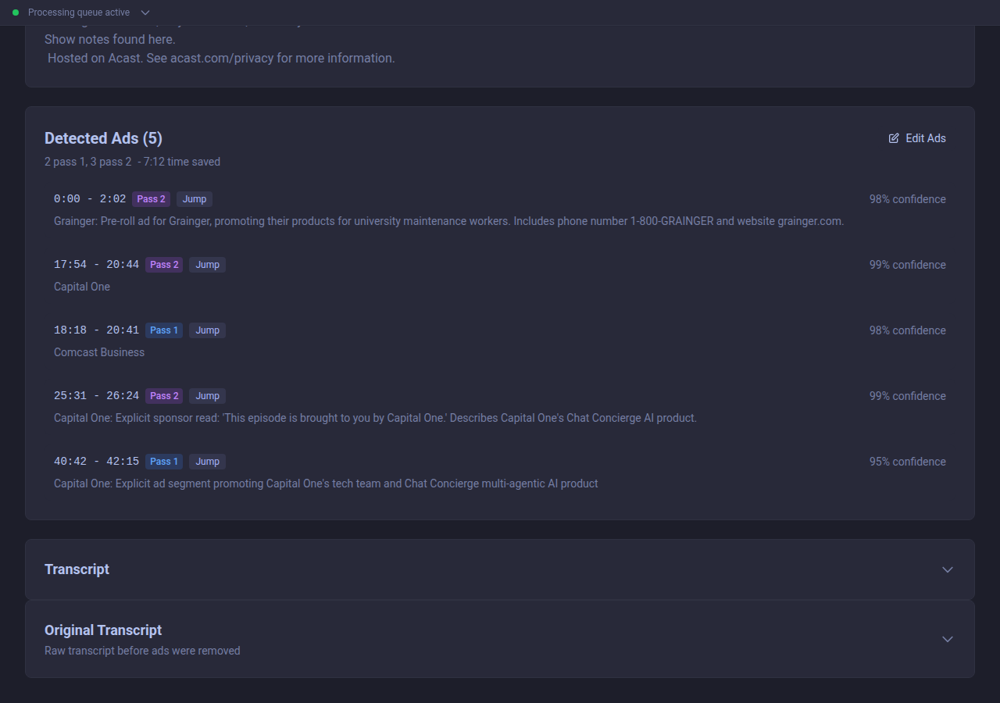 | 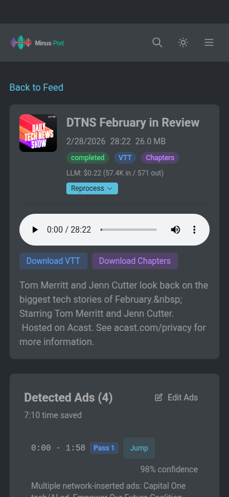 |

#### Ad Editor
| Desktop | Mobile |
|---------|--------|
| 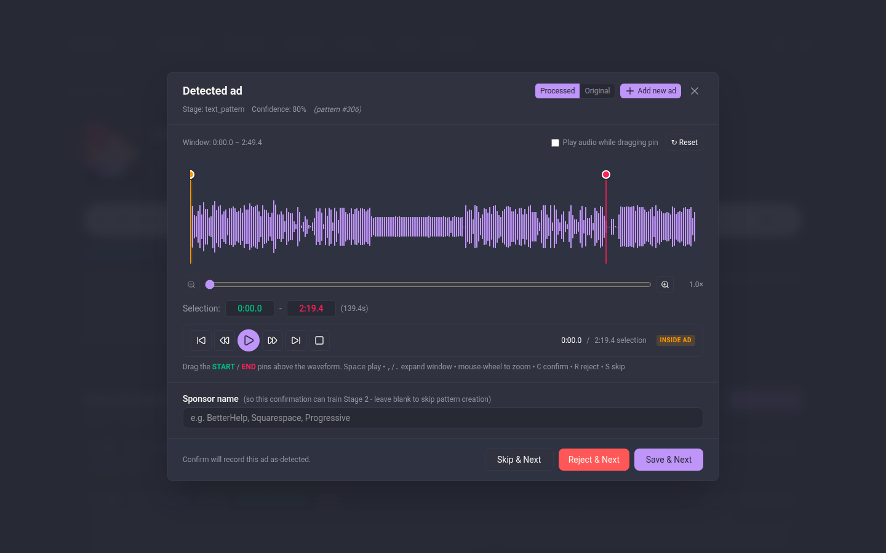 | 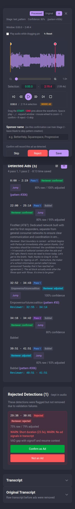 |

#### Ad Patterns
| Desktop | Mobile |
|---------|--------|
| 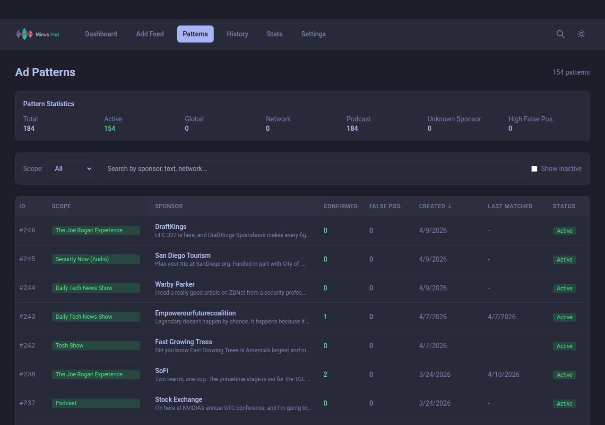 | 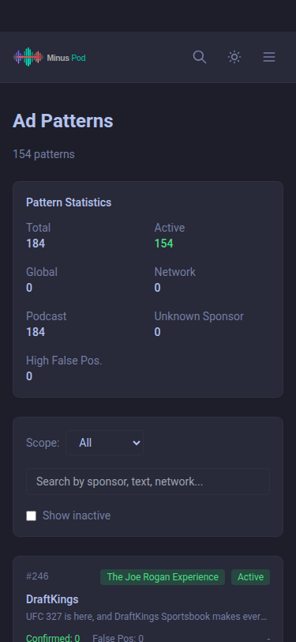 |

#### History
| Desktop | Mobile |
|---------|--------|
| 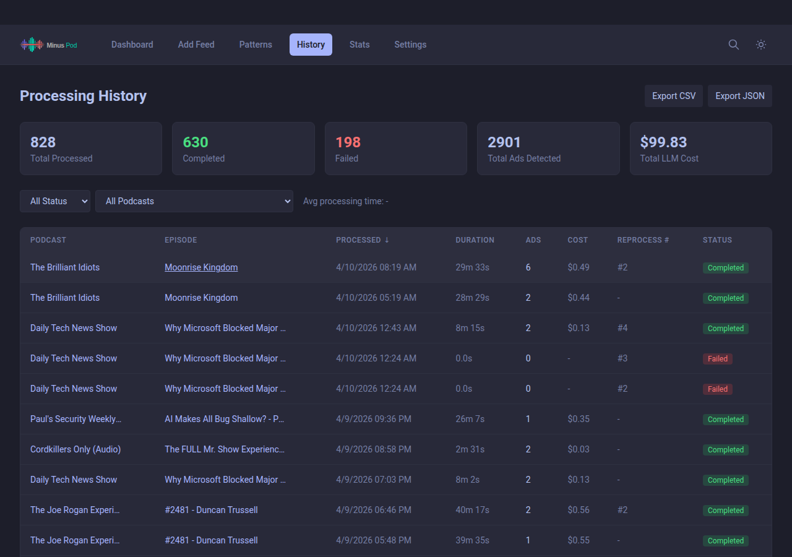 | 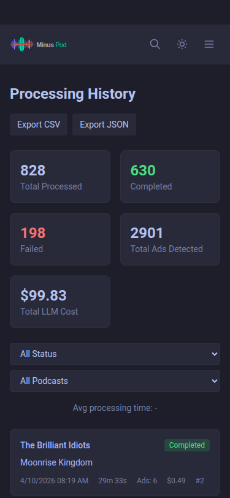 |

#### Stats
| Desktop | Mobile |
|---------|--------|
| 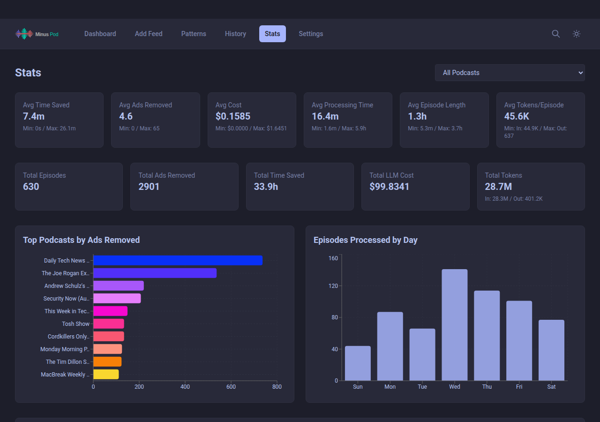 | 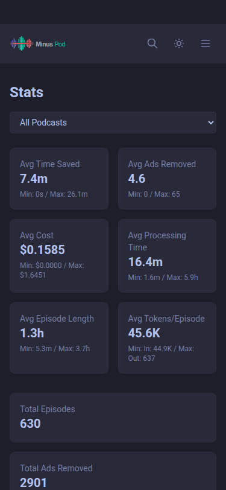 |

#### Settings
| Desktop | Mobile |
|---------|--------|
| 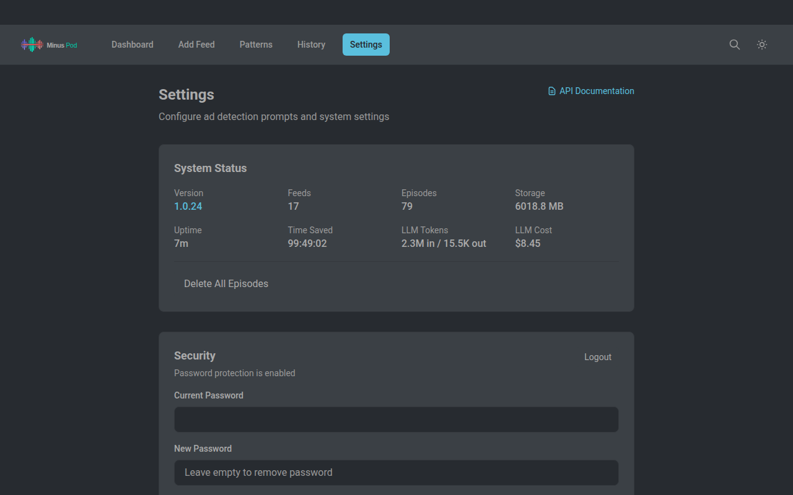 | 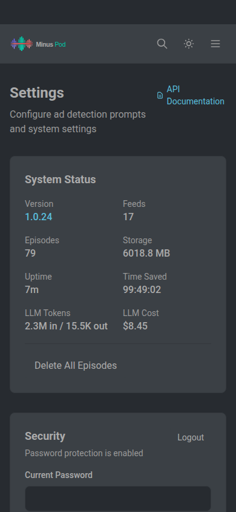 |

#### API Documentation

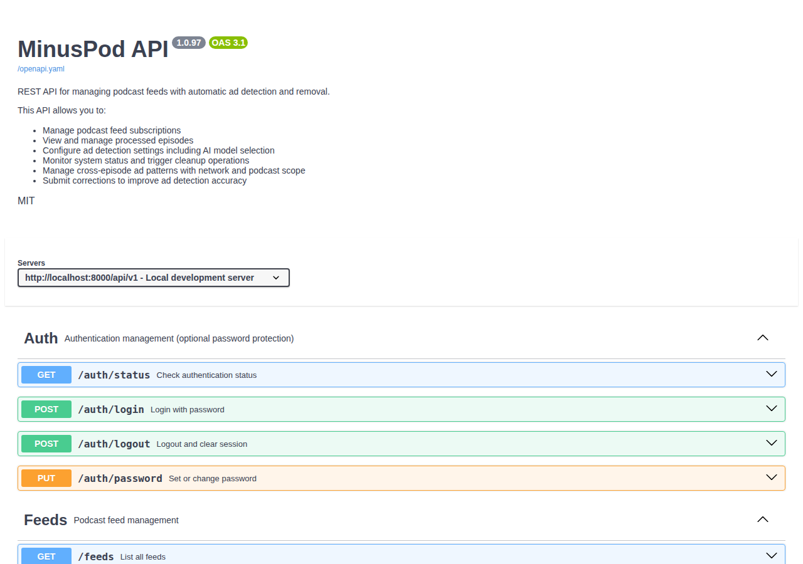

---

[< Docs index](README.md) | [Project README](../README.md)
