# Web Interface

[< Docs index](README.md) | [Project README](../README.md)

---

## Contents

- [Overview](#overview)
- [Dashboard views](#dashboard-views)
- [Episode actions and job state](#episode-actions-and-job-state)
- [Feed Display Title](#feed-display-title)
- [Sponsors and Normalizations](#sponsors-and-normalizations)
- [Ad Review Modes](#ad-review-modes)
- [Waveform Ad Editor](#waveform-ad-editor)
- [Adding a New Ad](#adding-a-new-ad)
- [Ad Review tab](#ad-review-tab)
- [Audio Cue Templates](#audio-cue-templates)
- [Held for Review](#held-for-review)
- [Partial Detection](#partial-detection)
- [Processing stats](#processing-stats)
- [LLM cost ledger](#llm-cost-ledger)
- [Screenshots](#screenshots)

## Overview

The server includes a web-based management UI at `/ui/`:

- Dashboard with feed artwork and episode counts
- Add feeds by RSS URL with optional episode cap
- Feed management: refresh, delete, copy URLs, editable display title, set network override, per-feed episode cap, per-feed transcription language override, per-feed detection notes (free text the model sees with every episode of that show; see [Configuration > Per-feed detection notes](configuration.md#per-feed-detection-notes)), per-feed chapter mode (keep the show's own chapters or always generate; see [Podcasting 2.0](podcasting-2.0.md)), per-feed cue match threshold and cue tuning overrides, silence-snap and transition-snap toggles (see [Audio Cue Detection](audio-cues.md))
- Deleting a podcast stops any episode still processing; the delete confirmation says so when one is active
- Source feed URL shown in Feed Settings with a copy button, and editable for when a publisher moves feeds or a CDN-wrapped URL keeps failing. The server fetches and parses the new URL before saving, so a typo cannot break the feed; existing episodes are kept (matched by GUID). The refresh log also prints which URL each feed pulls from
- Per-feed max ad duration cap: ads longer than the cap are held for review instead of cut (empty = no cap; applies on the next reprocess)
- Per-feed opening window exclusion: ad markers that begin inside the first N seconds of an episode are ignored, so an intro cue is not cut as an ad (empty = inherit the global setting, 0 = off, 1 to 600 s = this feed's window; applies on the next reprocess)
- Per-feed cue-gated approval: only ads with audio-cue evidence auto-cut; others are held for review (requires cue templates)
- Per-feed processing mode: one select with five presets: standard (detect and cut ads, the default), keep content only (experimental; marks show content and removes everything else, see [How It Works](how-it-works.md)), skip ad detection (still transcribes and builds chapters, but nothing is scanned or cut; for ad-free shows), pass-through (relays episodes with no transcription or ad removal, though audio may be transcoded for serving), or cue-only (experimental; cuts from cue pairs and previously learned ad patterns, no LLM call; needs one enabled ad-break-start and one enabled ad-break-end template, and exposes a per-feed safety policy and a skip-transcription toggle, see [Audio Cue Detection > Cue-only preset](audio-cues.md#cue-only-preset))
- Feed detail page groups its controls into collapsible sections so the page stays scannable. Inside Feed Settings, everyday controls (network, source feed, auto-process, title blacklist, processing mode, queue priority, retention, original audio, language, hide unprocessed, tags) sit at the top; Segment actions, Cue tuning, and the rarely-changed Advanced controls each fold into their own card
- Per-feed episode title blacklist: glob patterns that skip queuing and just-in-time processing for matching titles. See [Configuration > Title blacklist](configuration.md#title-blacklist)
- Per-feed queue priority (High / Normal / Low) with automatic boosts. See [Configuration > Queue priority](configuration.md#queue-priority)
- Segment actions card on the feed settings page, with a matching global card in Settings. See [How It Works > Segment Categories](how-it-works.md#segment-categories)
- Per-feed retention override: inherit the global window, keep for N days, or archive. See [Configuration > Per-feed retention](configuration.md#per-feed-retention)
- Per-feed original audio override on the same page: inherit the global "Keep original audio" setting, or force it on or off for one feed. Discarding the uncut copy roughly halves what the feed stores and takes effect on the next episode processed
- Per-feed stat cards above Feed Settings: episode counts by status (colored to match the status badges) plus totals for episodes processed, ads removed, time saved, and LLM cost
- Dashboard feeds show compact per-status counts (for example "10 Disc / 2 Pend / 4 Comp") so feed health is visible without clicking in
- Ad Distribution panel on the feed detail page: a histogram of where ads have historically been cut across the feed, with learned prior zones marked
- Feed page artwork links to the show's website in a new tab, when the feed declares one
- Episode discovery: all episodes surface on refresh, process any episode from the feed detail page
- Bulk actions: select multiple episodes to process, reprocess, run a full analysis, re-detect ads on the existing transcript, delete, or set/clear pass-through (the per-episode Recut Audio mode is not a bulk action)
- Pass-through can also be set or cleared for a single episode from its detail page (in the Reprocess menu). A pass-through episode skips transcription and ad removal, and its audio may be transcoded for serving; a chip on the episode header and a compact indicator in the episode list show which ones are set. Redundant when the whole feed already runs in pass-through mode, in which case the per-episode control is disabled
- Sort by publish date, episode number, or creation date; paginated (25/50/100/500 per page)
- Pattern management: view and manage cross-episode ad patterns with sponsor names; the detail modal edits a pattern's sponsor, text template, active state, and segment category; includes an Ad Review tab for triaging detections across all podcasts
- Review decisions are recorded as you make them, then applied together. The Ad Review and Detected Ads pages show an Apply recuts button that recuts each waiting episode once, however many decisions it collected. A feed's own page has the same button for just that feed's episodes
- Segment category is editable in place: on an Ad Review or Detected Ads row, in the Detected ad window, and per pattern in the Ad Patterns table. It is what decides whether a span is cut, beeped, or left in
- Sponsor management: view, add, edit, and remove sponsors, each with its linked-pattern count, created and last-matched dates, and tags
- Processing history with stats, filtering by podcast, and CSV/JSON export; failed runs show their error reason under the episode title, with the full text on hover
- Stats dashboard with charts: avg/min/max metrics, top podcasts by ads, episodes by day, token usage, sortable podcast table, and an addressing-modes card comparing contract compliance and ad yield per mode (see [Configuration > Ad Addressing Mode](configuration.md#ad-addressing-mode))
- JSON schema response format (Settings > LLM Provider): opt-in for OpenAI-compatible endpoints, probed per model, falling back to plain JSON mode where it is not supported (see [Configuration](configuration.md#json-schema-response-format))
- Settings for LLM provider, AI models, ad detection prompts, retention, system stats, token usage and cost. Each customizable prompt has its own Reset button next to its label (visible but disabled at default), alongside the section-wide reset-all button
- Database backups (Settings > Data & Security): encrypted downloads and scheduled plain SQLite snapshots. Scheduled controls include the cron schedule, destination, keep count, and a Back up now button that works with the schedule off
- Offline queue (Queue > Queue Control): hold episodes while a self-hosted LLM or Whisper endpoint is down. Processing resumes when it returns, with a configurable give-up window
- Whisper pool (Settings > Transcription): optionally process several episodes at once on a remote Whisper backend, with a cap on requests in flight
- Rate-limit hold (Queue > Queue Control): optionally pause the queue while the LLM provider reports a 429 with a reset time, instead of failing episodes
- Queue page: active jobs show progress and cancellation controls. The full waiting list is paginated, and each row has links and -/+ buttons that can raise or lower its priority. A row the scheduler will not admit yet says why, naming the blocked phase, the account slot, the reason, and when the block lifts
- Provider account switch (Settings > LLM Provider): changing a slot's endpoint or provider type lists the runs still bound to the current account before you save, and asks whether to requeue them on the new account (the default) or cancel them, so in-flight work is never moved silently
- Status bar showing processing progress across all pages through 2-second polling, with failure backoff up to 30 seconds. It also appears when the queue holds work with nothing running. The message names the provider reset time for a rate-limit pause or the unavailable service for an offline wait
- Outbound Requests (Settings > Data & Security): the User-Agent MinusPod sends when it fetches feeds, audio, and artwork, editable per string with a Reset back to the default, plus a toggle for whether download logs include URL query strings
- OPML export with original or ad-free (modified) feed URLs
- Optional cover-art badge that marks the filtered feed (Settings > Cover Art), with a Refresh all artwork button
- Global Defaults group in settings: Auto-Process, Max Feed Episodes, Only Expose Processed, verification, and cross-fetch differential. New feeds use these defaults; each feed can inherit or set an explicit override
- Chapter mode default in Settings > Transcripts & Chapters, with the same per-feed inheritance and override
- Queue priority boosts in Queue > Queue Control
- Notifications for processed episodes, permanent failures, auth failures, exhausted spend limits, and structural rate-limit hits, delivered by webhooks or native email (Settings > Notifications)
- Podcast search via PodcastIndex.org
- Search: start typing on any page, or press `/` or Ctrl+K, to open a keyboard palette, or use the search field on the Dashboard. Both return shows, episodes, and transcript matches together, spanning every episode status. The header magnifier, or the palette's own "Advanced search" link, opens a dedicated search page with type filters plus pattern and sponsor matches
- Multiple dark themes (Tokyo Night, Dracula, Catppuccin, Nord, Gruvbox, Solarized, and more) with light/dark toggle
- Installable as Progressive Web App (PWA)

### Dashboard views

The dashboard toolbar has a Podcasts / Episodes switch. Podcasts is the original view, one card or row per show, and it keeps the grid and list layouts and the sort control. Episodes reorganizes the same dashboard around recent work instead: one section per podcast, each with its cover, its title, its total episode count, a "View all episodes" link, and that show's newest episodes underneath.

The View menu sets how many episodes each podcast section shows, from 1 to 10, defaulting to 3. Both the chosen view and the chosen count are remembered in the browser, so the dashboard opens the way you left it.

Episode rows in this view are the same rows the feed page renders, with the same status badge, hold chip, pass-through indicator, and per-row action button, so nothing is lost by staying on the dashboard. The Recents feed is left out of the grouped view: its episodes belong to the shows they came from, so it would always render empty.

One request loads the episode groups rather than one request per show, and the dashboard asks for one page of feeds at a time rather than the whole subscription list. Sorting happens on the server before the page is cut, so a page is a slice of the sorted list rather than a sorted slice; changing the sort returns you to page one. Only the active view is fetched: the Podcasts grid never pays for the episode projection, and the Episodes view never fetches a second bare feed list. Screens that need every feed, such as the podcast pickers on Stats, History and Patterns, keep their own unpaginated request.

### Episode actions and job state

Process, Reprocess, Re-detect Ads, and Recut all read their enabled state from the server's authoritative view of whether a job is queued or running, rather than guessing from the episode's stored status. In the UI that means:

- The action button keeps one label per episode. An episode that has been processed before always reads Reprocess, even while it is queued again and its status has reverted to pending. Buttons share a fixed minimum width, so a column of them lines up instead of shifting as labels change.
- While a run owns the episode, the controls are disabled rather than merely slow. Submitting the same episode twice is not possible from the UI, and the API answers a duplicate submission with the same job state rather than a bare error, so the page reconciles instead of showing a failure.
- An episode waiting in the run queue shows a purple "queued" badge, not "pending". Pending means the episode is eligible for work; queued means work has actually been scheduled.

Error states are scoped to the action that produced them. A failed correction in the review panel marks only the button that was clicked, so Confirm ad, Confirm trimmed, and Not an ad no longer all read "Error!" when one of them fails. A rejected reprocess shows the server's own message. A failed run shows its reason under the episode title on the history page and in the header on the episode page. In the Processing stats table the word "failed" is a button: expanding it shows the error text inline with a Copy error action, so the reason is readable on a phone or by keyboard rather than only on hover.

### Feed Display Title

Each feed's title is editable. On the feed detail page, click the pencil next to the feed name, type a new name, and Save. Subscribers see this name in their podcast app: MinusPod rewrites the `<title>` in the served RSS and leaves the source feed's own title untouched. A "Custom" badge marks a feed that has an override; saving the field blank drops back to the source title.

Titles are capped at 500 characters and collapsed to one line, so a rename or a suffix like " (ad-free)" works, while newlines and control characters are stripped to keep the feed well-formed. Saving a new title regenerates the served feed, so the name updates on the app's next refresh.

### Sponsors and Normalizations

The Sponsors page lists known sponsors, each with its linked ad-pattern count, created date, last-matched date, and tags. You can add and edit a sponsor's name, aliases, category, and tags, toggle it active or inactive, filter by tag, search by name, and reveal inactive sponsors.

A sponsor can also carry a segment category. When set, every read that names the sponsor is filed under that category, whatever the detector called it. The marker takes it before the per-category action is applied, existing patterns for the sponsor show and match with it, the pass-1 prompt hint states it, and a pattern learned from a cut stores it. Use it for a host's own product that the model keeps labeling as a paid sponsor: set the sponsor to Self-promo once instead of re-categorizing each learned pattern.

Deleting a sponsor is permanent. Ad patterns linked to it are not deleted: their sponsor link is cleared (unlinked) so no pattern data is lost. The confirmation dialog shows how many patterns will be unlinked first.

Name normalizations moved to Settings > AI & Processing > Transcript Normalization: regex rules that rewrite messy or inconsistent sponsor names into one canonical form before matching (for example collapsing `ag 1`, `ag-1`, and `ag one` to `ag1`). The rules correct any misheard Whisper output, sponsor names included.

#### Normalization regex format

Each rule has two fields: `terms` (the regex to find) and `canonical` (the replacement). Rules are Python regular expressions applied with `re.sub` and the case-insensitive flag, so matching ignores case. A few specifics worth knowing:

- The text is lowercased before the rules run, so write `terms` against lowercase. After all rules run, runs of whitespace are collapsed to single spaces.
- Patterns are not anchored: they match anywhere in the text. Add `^` and `$` to anchor to the whole string.
- The replacement's casing decides what the rule does. An all-lowercase `canonical` (e.g. `ag1`) only canonicalizes the name used for matching. A `canonical` containing an uppercase letter (e.g. `Wegovy`) also acts as a transcript display correction, rewriting the visible transcript while preserving the casing around the match.
- The regex is validated when you save a rule; an invalid pattern is rejected with an error.
- `category` is one of `sponsor`, `url`, `number`, or `phrase`.

The API exposes these fields as `terms`/`canonical`; the older names `pattern`/`replacement` are still accepted when writing a rule.

### Ad Review Modes

The ad editor supports two review modes, selected by a toggle above the ads list:

- **Processed** (default): plays the post-cut output so you can verify what the final listener will hear. Ad timestamps map onto the new timeline.
- **Original**: plays the pre-cut download at the ad's original timestamps, so you can hear exactly what was removed.

Original mode requires the pre-cut audio to have been retained. That's controlled by the "Keep original audio for ad boundary review" toggle under Settings > Storage & Retention (default on). Keeping originals roughly doubles per-episode storage; disable it if disk is tight. The toggle is disabled (with a tooltip) until you reprocess.

Any single feed can override the retention window and the keep-original toggle on its own settings page; see [Configuration > Per-feed retention](configuration.md#per-feed-retention).

Original audio has its own retention input under the same section: "Retain original audio for: N days". Defaults to whatever the processed retention is. Set a smaller number to drop the pre-cut copy sooner while keeping the processed file for the full retention period (useful if originals are taking too much disk but you still want the processed output around for the normal 30-day window). Capped at the processed retention by the server; the input is disabled when "Keep original audio" is off.

The **Transcript** section on the Episode Detail page has one View transcript button. It opens a reader with a source select, Original for the full pre-cut text or Processed for what is served, and every segment carries its timestamps. There is a search box that marks each match, a start and end time window, and, on the original, a Highlight ads checkbox that tints the rows that were cut and names the sponsor.

### Waveform Ad Editor

Review and adjust ad detections in the browser. The editor is a wavesurfer.js waveform: drag the green start and red end pins to set boundaries, with an orange playhead, 1x to 20x zoom (slider or mouse wheel), and a transport bar (skip back, rewind 10s, play, forward 10s, skip forward, stop). A playback speed dropdown (0.5x to 2x) sits next to the play button, and a full-episode scrubber under the zoom slider lets you jump anywhere in the audio regardless of how the waveform is zoomed. The scrubber shows a muted gray band for the slice currently visible in the waveform, a primary-color fill tracking playback, and a thumb at the current position. Click or drag to seek; Arrow keys nudge by 5s (Shift = 10s), Home/End jump to ends. Edit Ads opens centered on the detected ad with ~30s of context; Add new ad opens with the entire episode visible. Typing a time outside the current waveform window auto-expands the window to include the pin. The Selection text inputs clamp only to episode bounds; cross-field validation (Start before End, at least 1s) happens on Save with a red border and an inline error if invalid.

Each ad shows why it was flagged, the confidence percentage, and the detection stage. The selection readout shows the current bounds plus the originals if you've moved a pin. An INSIDE AD badge lights up when the playhead sits between the pins. Playback auto-seeks to ~2 seconds before the ad start when you open or switch ads, so you land in context instead of at the beginning of the episode.

A header row above the waveform lets you toggle Processed / Original (separate from the page-level toggle: this one applies to what plays in the editor) and jump straight into create mode with `+ Add new ad`. Waveform colors follow the active theme; the dark theme uses the same muted/primary palette as the rest of the UI so the pins and playhead stay readable on both backgrounds.

Sponsor is a real autocomplete combobox seeded from the known-sponsor catalog plus any sponsors you've used recently on this podcast. Typing filters the list; clicking a row fills the field. You can also just type a new name and submit.

On mobile the layout stacks vertically and the keyboard hint footer goes away; everything is touch-driven from there.

On desktop you get `Space` for play/pause, arrow keys to nudge the focused pin, mouse wheel to zoom in or out anchored on the cursor, and `C` / `R` / `S` to confirm / reject / skip. Clicking the dimmed backdrop closes the editor in review mode; backdrop-close is disabled in create mode so you don't lose an in-progress entry by clicking outside.

### Adding a New Ad

If the detector missed one, click `+ Add new ad` from the episode page header or from the same button inside the editor modal. The editor opens in create mode against the original (pre-cut) audio so you hear exactly what the listener would have heard.

The modal has two input modes, toggled by a tab strip at the top:

- **By audio** (default): enter start and end timestamps or drag the pins on the waveform. The text template auto-populates from the transcript span between your bounds.
- **By text**: the original transcript renders with word-level Whisper timestamps. Select a span of text in the browser; the resolved word boundaries populate the start/end timestamps and the template. A search box with `N of M` navigation jumps between matches. The selected text stays highlighted on mobile too, so the selection is visible after the keyboard closes.

Switching tabs preserves your selection, so you can refine bounds in either view. Pick a sponsor from the autocomplete or type a new one. A Category select classifies the span (sponsor, cross-promo, self-promo, and the rest); the chosen category is stamped on both the manual marker and the pattern created from it, and each feed's segment actions decide what happens to future matches. Left as Uncategorized, the pattern resolves as Sponsor. The optional Reason field is available in both modes.

Submitting creates a new pattern with `created_by='user'` and writes a `'create'` correction so the pattern matcher picks it up on future episodes. The Patterns page tags manually created patterns with a `Manual` badge and adds an Origin filter (All / Auto / Manual).

### Ad Review tab

The Patterns page has two tabs: Patterns and Ad Review. The Ad Review tab lists ad detections across all your podcasts so you can triage them without opening each episode.

Each row covers one detected segment: podcast name, episode title (linked to the episode page), publish date, start/end timestamps and duration, sponsor name, confidence score, detection stage, status, and resolution.

#### What the badges mean

A row carries up to three badges, and each answers a different question.

| Badge | Question it answers | Meaning |
|---|---|---|
| Accepted | What did the audio do? | The span was cut out of the published file |
| Not cut | What did the audio do? | The span is still in the file |
| Pending | What did the audio do? | The episode is still processing |
| Confirmed | What did you decide? | You said this is an ad |
| Not an ad | What did you decide? | You said it is not |
| Kept | Why was it left in? | Its category resolves to keep, so it was never a candidate to cut |
| Adjusted | Did the reviewer move it? | The ad reviewer moved the boundaries; hover the badge for the span it started from |

A detection you have not decided on yet gets no second badge. Undecided is the normal state in this list, so a badge on every row would say nothing.

"Not cut" and "Not an ad" read alike but are not the same. "Not cut" is what happened to the audio; a span can be left in because the validator rejected it, because you dismissed it, or because its category is set to keep. "Not an ad" is your recorded judgment.

A Detection Statistics card above the filters shows totals by status and resolution across all podcasts. On phones the list renders as stacked cards instead of a table, with a sort control in the filter bar.

The tab opens with "Needs review" selected. That filter shows detections still waiting on a decision from you: held for review, or left uncut, with no correction recorded. Other options are Pending review, Rejected, Accepted, and All.

Segments left in by their category are not in "Needs review". Their fate is already settled by the feed's segment actions, and the corrections endpoint refuses a verdict on one, so listing them would offer a decision nobody can make. Change the category to move one, or find them under Rejected and All.

A podcast dropdown narrows the list to one feed. The Reviewer dropdown, on this tab and on Detected Ads, shows only rows whose span the ad reviewer moved, or only rows it left where they were. The search box filters by sponsor name or detection reason. The list shows 20 rows per page.

Each row has up to five actions:

- **Play** - auditions the pre-cut audio for that segment in the browser. Only appears when the original is retained (see Settings > Storage & Retention). Click again to pause.
- **Confirm ad** - records a confirm correction and marks the episode for a recut.
- **Not an ad** - records a rejection.
- **Category** - sets the segment category, which is what decides whether the span is cut, beeped, or left in. This is the only action on a row left in by its category, and it is how you change that.
- **Edit** - opens the waveform editor so you can adjust the ad boundaries before deciding.

Confirm ad and Not an ad only appear for a detection still awaiting a decision, and never on one left in by its category. Recording a decision does not re-cut the episode on the spot: it marks the episode, and an Apply recuts button above the list rebuilds every waiting episode once. An episode you edit five times is rebuilt once rather than five times. The same button appears on a feed page, where it covers only that feed's episodes.

Corrections go through the same per-episode corrections endpoint used on the episode page, so approve and dismiss decisions feed pattern learning the same way.

### Audio Cue Templates

If a show plays a recurring ding or stinger around its ad breaks, you can teach MinusPod that exact sound and have it snap cuts to the chime. Marking a cue, the find-audio-cues scan, the cross-episode scan, the window optimizer, cue types, and cue management are all covered in [Audio Cue Detection](audio-cues.md). Each template row shows its last match date and, once it has matched before but produced no above-threshold matches in the feed's last 5 episodes, an amber "quiet" badge, so a publisher swapping their stinger shows up before a cue-only feed silently stops cutting ads.

### Held for Review

When a feed has a max ad duration cap or cue-gated approval on, ads that cannot auto-cut are held rather than cut. The episode publishes with the audio intact. Held ads appear on the episode page in an amber "Held for Review" section with two actions per row:

- **Approve & Recut** - stores a confirm correction and immediately re-cuts the original audio if retained; otherwise the button reads Approve and the cut applies on the next reprocess.
- **Dismiss** - records a rejection and leaves the audio unchanged.

When the original audio is retained, a pencil button next to the play button opens the ad in the waveform editor, where you can drag the boundaries before confirming; confirming with moved boundaries cuts only the span inside the pins. If the hold came from the ad reviewer proposing a boundary past the detected span, confirming at that position is accepted too, not just a narrower one.

The episode list shows an amber "N held" chip for any episode with pending held ads. See [Held for Review](how-it-works.md#held-for-review) for what triggers a hold.

### Partial Detection

When the AI detection pass fails but pattern and cross-fetch evidence already produced cuts, the episode still publishes: an amber "Partial detection" badge appears in the episode header (hover for the failure reason), and a warning banner below explains that some ads may remain, with a **Re-run detection** button that reprocesses using the LLM. See [How It Works > Partial Detection](how-it-works.md#partial-detection) for when this happens and the automatic follow-up re-detect.

### Processing stats

Every processing run records what it actually worked with, and the episode page shows it in a "Processing stats" section at the bottom, collapsed by default. Each row shows when the run started, downloaded length, LLM detection window count, and hits per stage. It also reports the final cut / held / kept split, ad time removed, second-scan result, and token cost. Recuts omit detection details but retain timing for the work they perform.

Durations use clock formatting (`M:SS` or `H:MM:SS`). The total is elapsed wall-clock time through saving the episode and feed. Stage times can overlap, and FFmpeg runs inside those stages, so the timing columns are not meant to be added together. The FFmpeg total sums every FFmpeg task in the run, including retries. Transcription, detection, or verification configured not to run says Skipped. A missing time in another measured run says Unavailable; a run saved before timing was recorded says Timing unavailable.

Two things make this table earn its place. First, feeds with dynamic ad insertion serve a different copy per download: the Downloaded column shows it directly, and a note calls out when the copy differs from the duration the feed declares. Second, when a run removes far less ad time than the feed's recent average, the episode header shows an amber "Low ad yield" badge with the numbers, so a lightly-filled download does not read as a detection failure.

Completed episodes also state the verification result under the header: whether the second scan of the output audio found anything left to cut.

Expanding a run shows its per-phase cost breakdown: one row per pipeline phase with the provider it routed to, the model that answered, input and output tokens, and cost. Cache and reasoning token columns appear only when a run has them. A phase that retried onto a different model contributes more than one row, which is how a fallback becomes visible rather than being averaged away. Detection and verification are listed even when they did not run, labelled Skipped, Not applicable, or Unavailable, so a missing row is never ambiguous. A run recorded before the cost ledger existed, or a recut, shows "Breakdown unavailable" and keeps only its recorded total.

The episode header carries up to three spend readouts: **Active run** while a run is in flight, updated from the ledger as it spends; **Latest run** for the most recent attempt, a failed one included; and **Total spend**, the episode's recorded ledger spend, which reads "Recorded so far" while processing. Historical calls made before the ledger existed are not included in that cumulative figure. When some calls in a figure have no resolved price, the readout says "known spend" and an amber **Incomplete** chip marks it, because the amount is a floor rather than the real total. Setting a price for the model in question (Settings > AI & Processing > AI Models) lets subsequent calls resolve their cost; it does not reprice already-finalized calls or clear their Incomplete status. On the Stats page the Incomplete chip on an episode's cumulative spend is itself a button. It lists the calls behind the figure, one row per recorded attempt with its phase, provider and account slot, model, outcome, tokens, cost or "Unknown", and timestamp. An unpriced call can then be named instead of leaving a gap in a total.

### LLM cost ledger

The Stats page has an **LLM cost ledger** card holding two paginated tables over the same underlying record of every LLM call, including calls made by runs that later failed or were cancelled.

One filter bar drives both tables, plus the summary line above them:

- **From** and **To** dates. These select whole UTC days, inclusive at both ends, so picking the same date twice gives you that entire UTC day. They are UTC days, not local ones, and not a timestamp range.
- **Podcast**, narrowing to one show.
- **Provider** and **Model**. Their options come from the ledger itself, scoped by the date and podcast filters already set. The list is complete rather than paginated, so a model that only appears on the fifth page of results is still selectable. Choosing a provider clears the model selection, since the model list belongs to the provider.

Above the tables, a line states what the figures cover: "Lifetime spend (all recorded runs)" with no date filter set, or an interval description naming the bounds when one is. Changing any filter returns both tables to page one.

Those filters, both tables' sort columns and directions, and both page numbers live in the page's URL. Reloading restores the view, and the address bar is a shareable link to a specific cost question. Nothing secret is written there: only filter values, sort keys and page numbers, and a value left at its default is omitted rather than spelled out.

A row of section links sits under the Stats heading and jumps straight to Overview, Charts, Reviewer, Addressing, Audio cues, Spend or Podcasts, so the ledger is one tap away on a phone instead of a long scroll. Links are listed only for sections on the page.

**Provider and model usage** lists one row per provider and model combination, so a model id served by two providers stays two rows. Each row carries call count, distinct episodes, input and output tokens, cost, and a **Coverage** column. Coverage reads "Fully priced" when every call in the row had a resolvable price, and "3 of 12 unpriced" when some did not, which is the same condition the episode page marks as Incomplete. Expanding a row shows its detail. Every column is sortable, server-side, so sorting spans the whole result rather than the current page.

**Episode costs** lists one row per episode with its podcast, the models used, how many runs it took, the latest run's cost, its cumulative cost, and when it last spent anything. The two cost figures answer different questions and diverge once an episode has been reprocessed: the latest-run figure always describes that episode's actual latest run and is not narrowed by the provider or model filter, while the cumulative figure sums only the runs matching every filter. Each row links to its episode.

### Screenshots

#### Dashboard
| Desktop | Mobile |
|---------|--------|
| 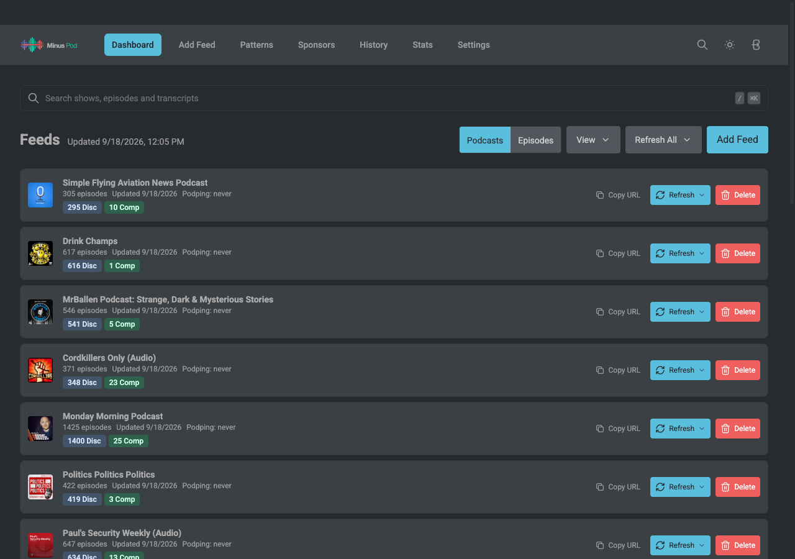 | 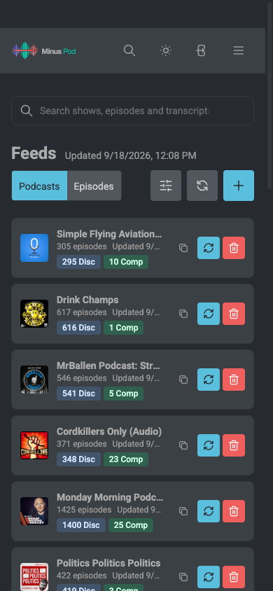 |

#### Feed Detail
| Desktop | Mobile |
|---------|--------|
| 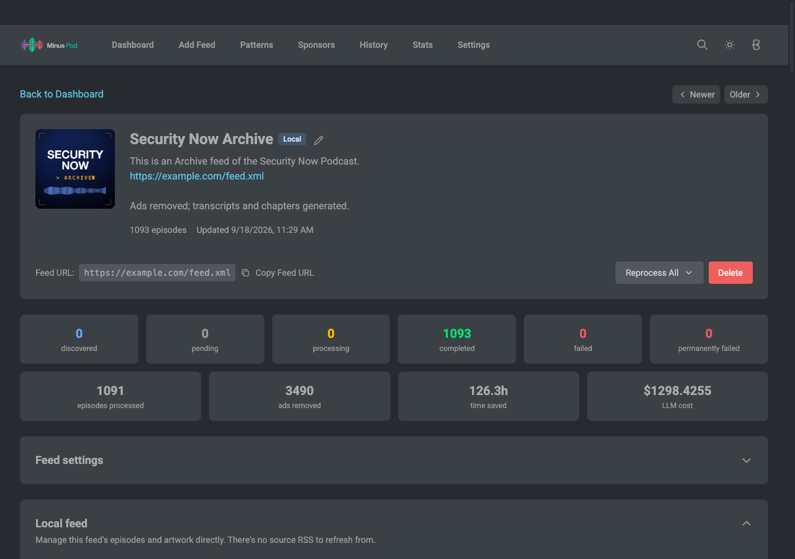 | 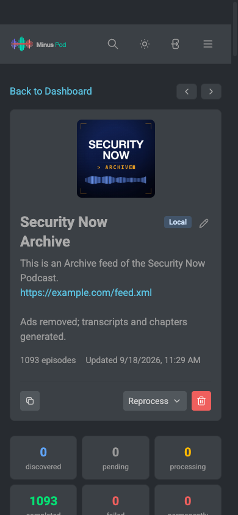 |

#### Episode Detail
| Desktop | Mobile |
|---------|--------|
| 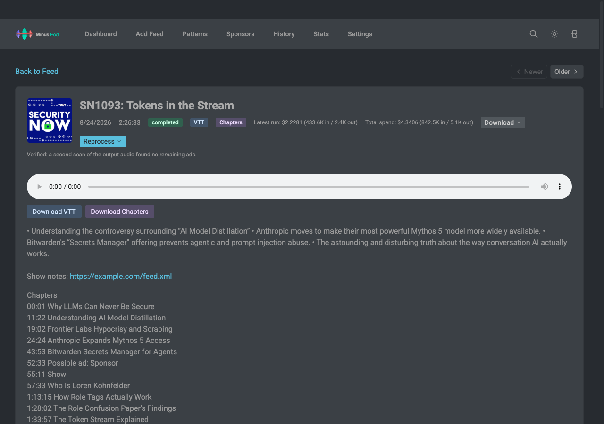 | 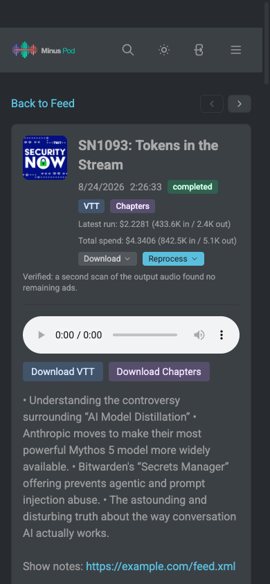 |

#### Detected Ads
| Desktop | Mobile |
|---------|--------|
| 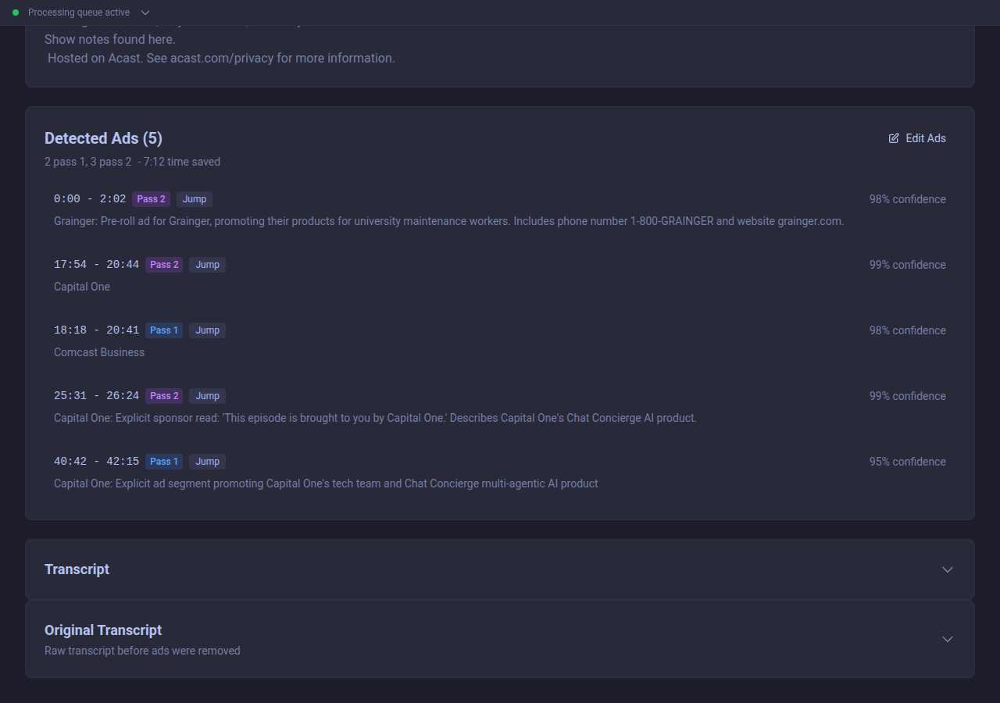 | 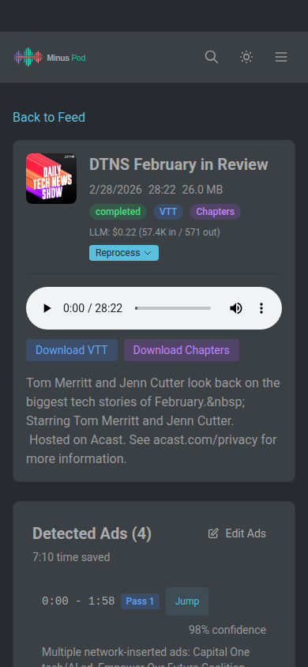 |

#### Ad Editor
| Desktop | Mobile |
|---------|--------|
| 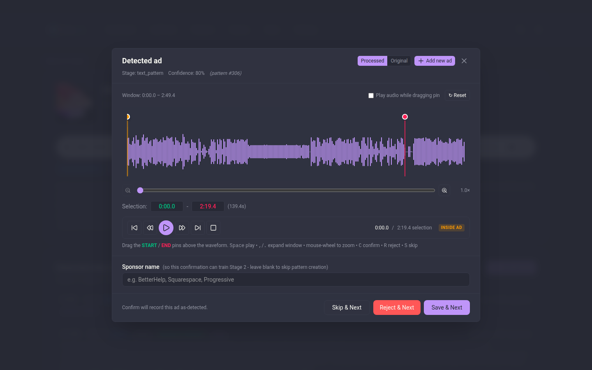 | 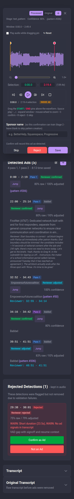 |

#### Ad Patterns
| Desktop | Mobile |
|---------|--------|
| 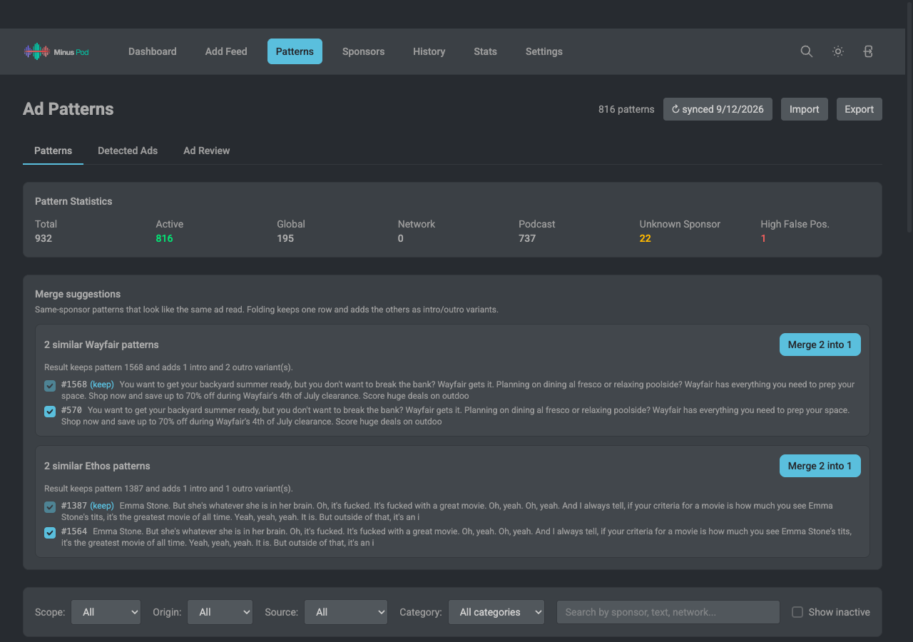 | 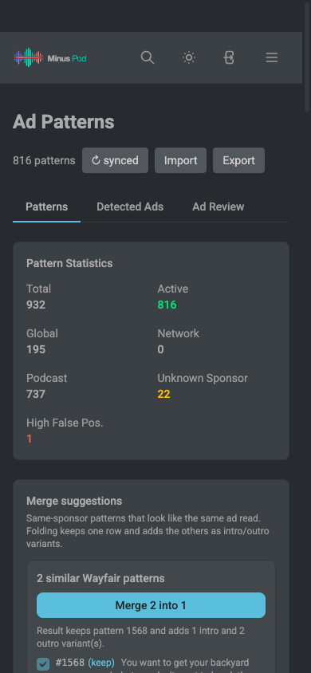 |

#### Sponsors
| Desktop | Mobile |
|---------|--------|
| 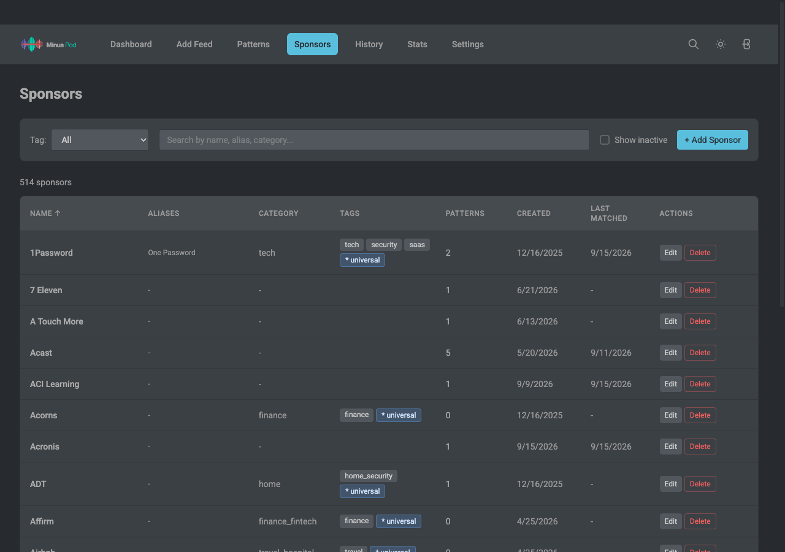 | 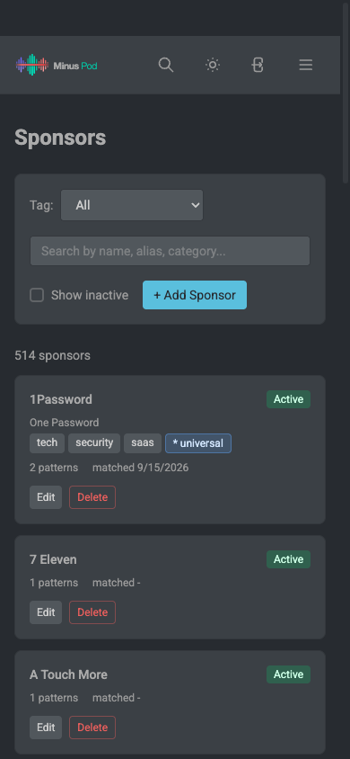 |

#### History
| Desktop | Mobile |
|---------|--------|
| 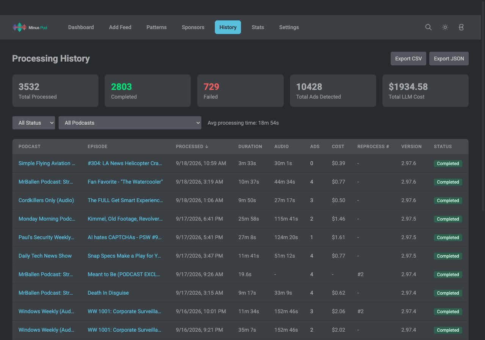 | 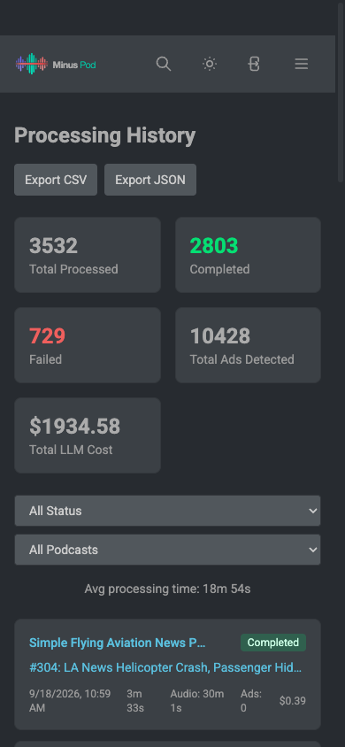 |

#### Stats
| Desktop | Mobile |
|---------|--------|
| 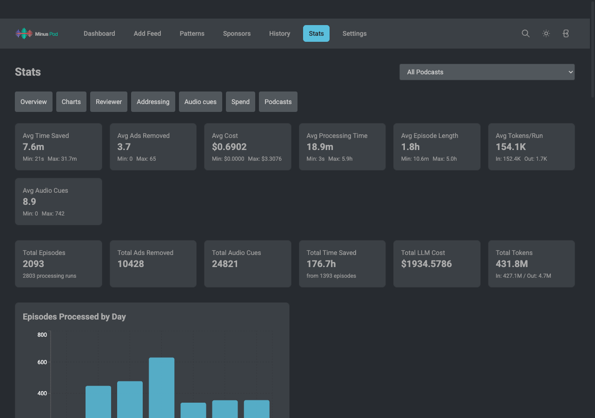 | 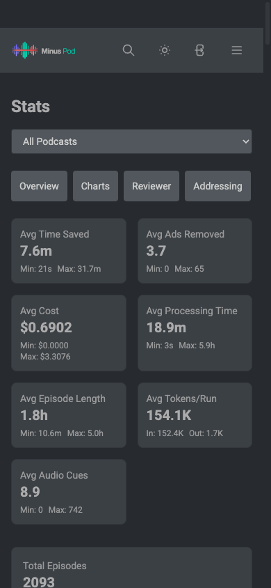 |

#### Settings
| Desktop | Mobile |
|---------|--------|
| 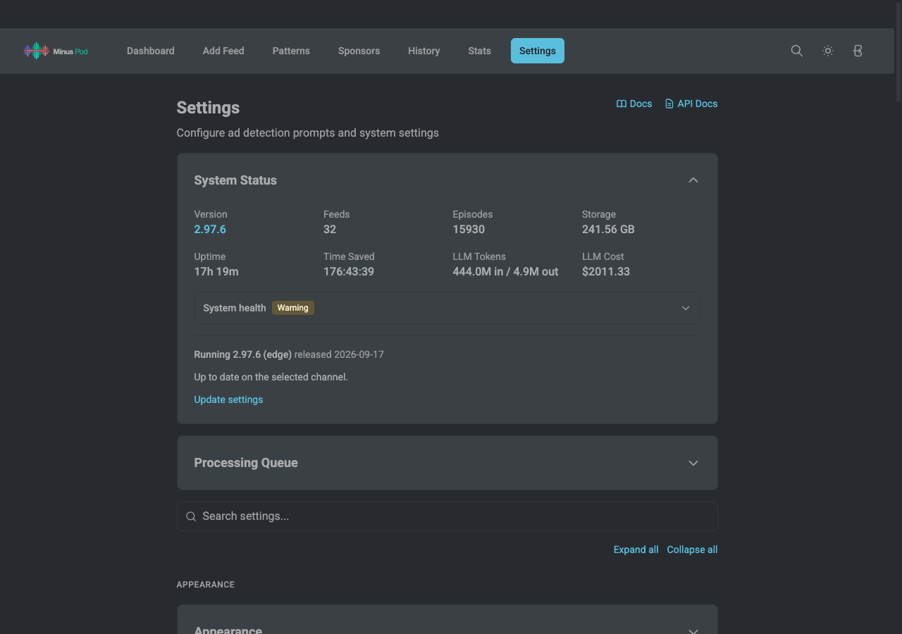 | 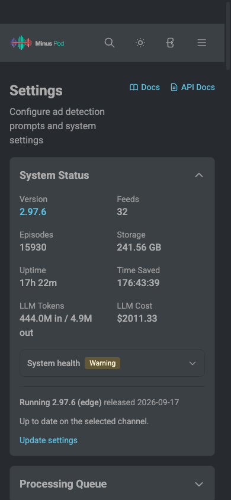 |

---

[< Docs index](README.md) | [Project README](../README.md)
