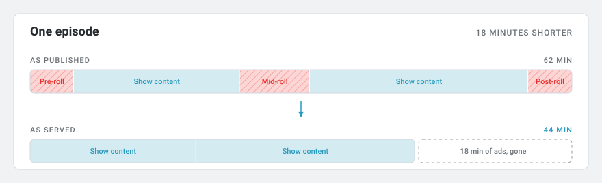
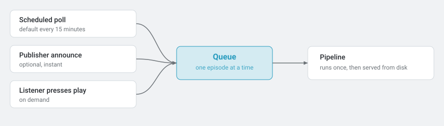
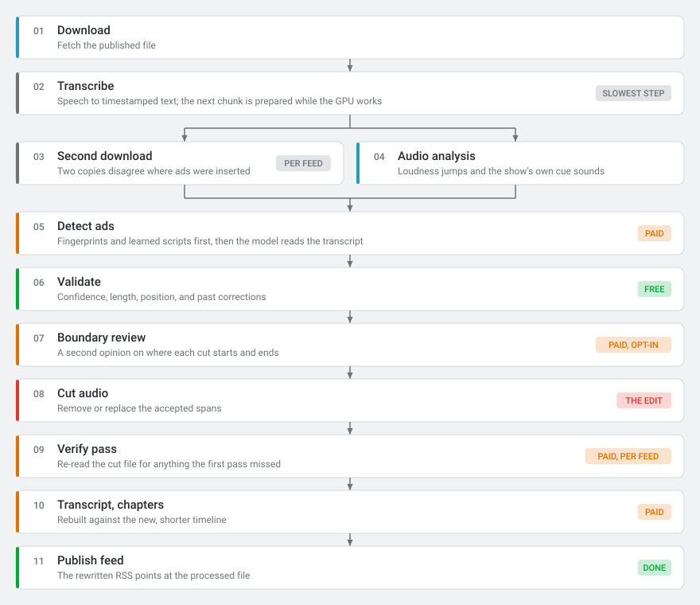
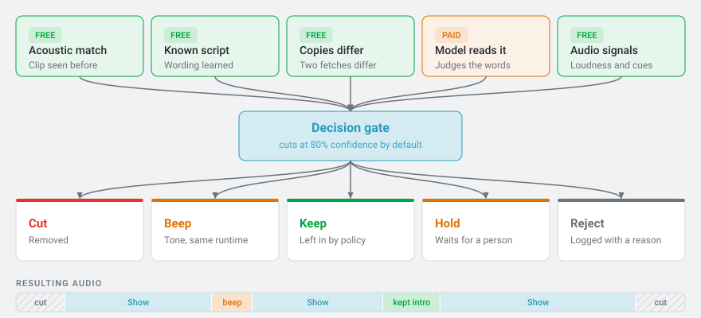
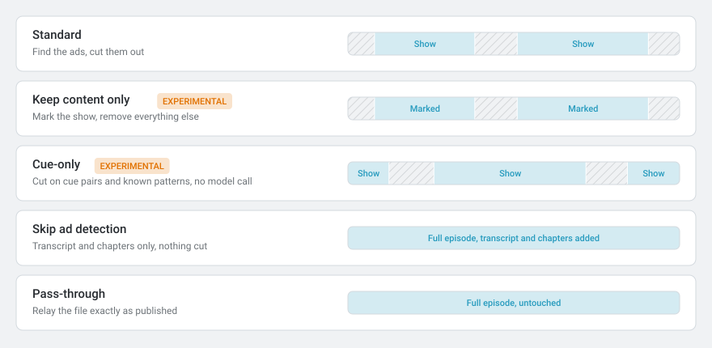
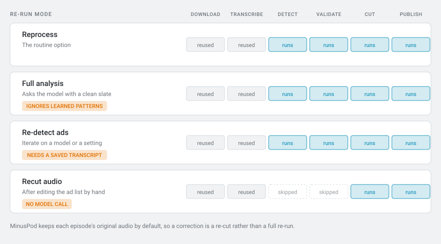
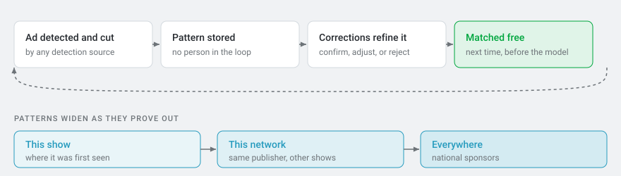
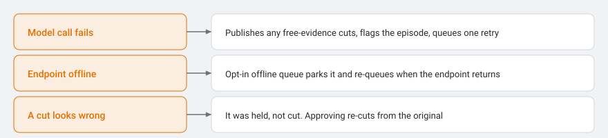

# Episode Processing Workflows

[< Docs index](README.md) | [Project README](../README.md)

Every way MinusPod can process an episode, in pictures. For the behaviour
behind each stage, see [How It Works](how-it-works.md).

---

## The job

<picture>
  <source media="(prefers-color-scheme: dark)" srcset="images/wf-overview-dark.svg">
  
</picture>

The listener subscribes to a MinusPod address once. Everything below happens
behind that address.

---

## How work arrives

<picture>
  <source media="(prefers-color-scheme: dark)" srcset="images/wf-arrival-dark.svg">
  
</picture>

---

## The standard pipeline

<picture>
  <source media="(prefers-color-scheme: dark)" srcset="images/wf-pipeline-dark.svg">
  
</picture>

Amber badges mark the stages that make an LLM call. Transcription is billed too
if you point it at a hosted Whisper API; on a local GPU it costs only time.

---

## Five kinds of evidence, five outcomes

<picture>
  <source media="(prefers-color-scheme: dark)" srcset="images/wf-detection-dark.svg">
  
</picture>

Four of the five cost nothing. Fingerprints, learned scripts and the two-copy
comparison are gathered before the model reads the transcript, and go into its
prompt as hints. Audio signals are measured then too, but only promote or extend
a cut after detection runs. Whatever a source proposes still has to clear the
gate.

---

## Processing modes

One mode per feed. Changing it does not change the published address.

<picture>
  <source media="(prefers-color-scheme: dark)" srcset="images/wf-modes-dark.svg">
  
</picture>

| Stage | Standard | Keep content | Cue-only | Skip detection | Pass-through |
|---|:-:|:-:|:-:|:-:|:-:|
| Transcribe | yes | yes | optional | yes | no |
| Second download | per feed | per feed | per feed | no | no |
| Audio analysis | yes | yes | yes | no | no |
| Model reads transcript | yes | inverted | no | no | no |
| Learned patterns | match, learn | match only | match, learn | no | no |
| Verify pass | per feed | per feed | no | no | no |
| Audio edited | yes | yes | yes | no | no |
| Transcript, chapters | yes | yes | optional | yes | no |

**Keep content safety net.** Marked content has to cover at least 55% of the
runtime, no single cut may exceed 7 minutes or a quarter of the episode, and
every transcript window has to come back labelled. Miss any of those and the
episode falls back to standard detection on its own.

---

## Re-running an episode

<picture>
  <source media="(prefers-color-scheme: dark)" srcset="images/wf-rerun-dark.svg">
  
</picture>

Reprocess and full analysis reuse the saved transcript when there is one, and
transcribe again when there is not. Re-detect ads always needs one, so it skips
episodes that have none.

---

## Learning loop

<picture>
  <source media="(prefers-color-scheme: dark)" srcset="images/wf-learning-dark.svg">
  
</picture>

Every pattern carries its own confirmation and false-positive counts. One you
created or confirmed always cuts what it matches; one the system learned on its
own still answers to the category actions set for the feed.

Community sync is opt-in in both directions. Nothing local is published unless
you submit it.

---

## When something breaks

<picture>
  <source media="(prefers-color-scheme: dark)" srcset="images/wf-failure-dark.svg">
  
</picture>

Nothing fails silently. A run with no free evidence to fall back on, or one that
died on a bad API key, fails outright and waits for you on the episode page. The
offline queue is off until you turn it on; without it, an unreachable endpoint
retries and then gives up.

---

Diagrams are generated, not hand-drawn. Edit
[`scripts/generate_workflow_diagrams.py`](../scripts/generate_workflow_diagrams.py)
and re-run it to rebuild `docs/images/wf-*.svg`. Colors come from the
`index.css` tokens, so they track the app's own theme.

[< Docs index](README.md) | [Project README](../README.md)
